# Choreography: local-first defaults, the menu-bar app, and recorded notes

Twenty runs, four releases. Each run is executed with `implement-spec`, one task at a time, and hands over through its `report.md` and a green `validate-exit.sh`. Sequencing is the harness's job (branches, agent runs, hooks as gates); this document is the contract and the audit trail, not a script to hand-walk. The owner asked for the smallest chunks possible: no run exceeds about 20 hours, and nine of them are under six.

## Order

```mermaid
graph LR
  R1[run-1 defaults] --> R2[run-2 decoding] --> R3[run-3 llm.py] --> R4[run-4 keychain] --> R5[run-5 keys tab] --> R6[run-6 release 0.12.0]
  R6 --> R7[run-7 spike + builder] --> R8A[run-8a app Swift] --> R8B[run-8b app Python] --> R9[run-9 doctor/integrate/setup] --> R10[run-10 release 0.13.0]
  R10 --> R11[run-11 cue/hold/paste] --> R11B[run-11b playback pause] --> R12[run-12 release 0.13.1]
  R12 --> R13[run-13 spikes] --> R14[run-14 local model] --> R15[run-15 notes] --> R15B[run-15b recording pause] --> R16[run-16 release 0.14.0]
  R17[run-17 optional spikes<br/>any time, no release path]
```

| Run | Directory | Tasks | Branch / isolation | Tier | Owner needed |
|---|---|---|---|---|---|
| 1 | [run-1-local-first-defaults](./run-1-local-first-defaults/project-plan.md) | T-01…T-04 | `local-first` off `main` after 0.11.0 | Sonnet | no |
| 2 | [run-2-stt-decoding](./run-2-stt-decoding/project-plan.md) | T-10…T-12 | `local-first` | Sonnet; the q8_0 hash pinned from a real download | two timing measurements on the owner's Mac, no click |
| 3 | [run-3-llm-and-enums](./run-3-llm-and-enums/project-plan.md) | T-20…T-27 | `local-first` | Opus (a security-sensitive seam: prompts, argv, environment) | no |
| 4 | [run-4-keychain](./run-4-keychain/project-plan.md) | T-30…T-33 | `local-first` | Opus (the check is interpreted; the backend touches the real keychain) | present for a possible keychain prompt in T-30 |
| 5 | [run-5-keys-tab](./run-5-keys-tab/project-plan.md) | T-40…T-44 | `local-first` | Sonnet; Opus reviews the two new routes before commit | no |
| 6 | [run-6-release-0-12-0](./run-6-release-0-12-0/project-plan.md) | T-50…T-52 | `local-first`; owner merges and publishes | Opus review, Sonnet docs | yes: manual checks 1–3, merge, publish |
| 7 | [run-7-hotkey-spike-and-builder](./run-7-hotkey-spike-and-builder/project-plan.md) | T-60…T-62 | `app` off `main` after 0.12.0 | Opus (the spike is interpreted; the golden test guards a re-grant) | yes: the three presses of T-60 |
| 8a | [run-8a-app-swift](./run-8a-app-swift/project-plan.md) | T-70 | `app`; writes only under `vocalize/menubar/` | Opus (unfamiliar API; the source must be complete first time) | no |
| 8b | [run-8b-app-python](./run-8b-app-python/project-plan.md) | T-71…T-76 | `app`, after 8a | Sonnet; Opus reviews T-72 before commit | the real build check needs the Accessibility click |
| 9 | [run-9-doctor-integrate-setup](./run-9-doctor-integrate-setup/project-plan.md) | T-80…T-84 | `app`, after 8b | Sonnet | no |
| 10 | [run-10-release-0-13-0](./run-10-release-0-13-0/project-plan.md) | T-90…T-92 | `app`; owner merges and publishes | Opus review, Sonnet docs | yes: manual checks 4–8, merge, publish |
| 11 | [run-11-cue-hold-paste](./run-11-cue-hold-paste/project-plan.md) | T-100…T-105 | `hold-to-talk` off `main` after 0.13.0; `vocalize/menubar/` read-only | Opus (a state machine and a trim on real audio timing) | yes: the Bluetooth input for T-100 |
| 11b | [run-11b-playback-pause](./run-11b-playback-pause/project-plan.md) | T-106…T-109 | `hold-to-talk`, after 11; `vocalize/menubar/` read-only | Sonnet; Opus reviews the `stop` routing branch before commit | yes: manual checks 15 and 16 |
| 12 | [run-12-release-0-13-1](./run-12-release-0-13-1/project-plan.md) | T-110…T-111 | `hold-to-talk`; owner merges and publishes | Opus review | yes: manual checks 9–11 and 15–16, merge, publish |
| 13 | [run-13-spikes](./run-13-spikes/project-plan.md) | T-120…T-122 | `notes` off `main` after 0.13.1; spikes in scratch environments | Opus (the numbers become DEC-034) | yes: the owner reads the jargon clip |
| 14 | [run-14-local-llm](./run-14-local-llm/project-plan.md) | T-130…T-135 | `notes` | Opus (token-id prompt building, manifest hardening) | a 3 GB verified download on the owner's Mac |
| 15 | [run-15-notes](./run-15-notes/project-plan.md) | T-140…T-146 | `notes`, after 14 | Sonnet for the module and tests; Opus reviews the untrusted-input paths | yes: the 3-hour real-audio pass |
| 15b | [run-15b-recording-pause](./run-15b-recording-pause/project-plan.md) | T-147…T-149 | `notes`, after 15; `vocalize/recorder/` and `vocalize/menubar/` read-only | Opus (segment joining, the budget arithmetic, and the `_second_press` branch a paused take falls into) | yes: manual checks 17 and 18 |
| 16 | [run-16-release-0-14-0](./run-16-release-0-14-0/project-plan.md) | T-150…T-152 | `notes`; owner merges and publishes | Opus review, Sonnet docs | yes: manual checks 12–14 and 17–18, merge, publish |
| 17 | [run-17-optional-spikes](./run-17-optional-spikes/project-plan.md) | T-160…T-162 | scratch, outside the repo; nothing under `vocalize/` changes | Opus, owner present | yes, for every spike |

Runs 1 and 2 are each under four hours and may run back to back in one session; so may 12 and 13, and so may 11b and 12. An executor may step a tier up after a failed retry and must say so in `report.md`.

## Artifact dependencies

| Produced by | Artifact | Consumed by |
|---|---|---|
| run 1 | `DEFAULT_CHAIN` flipped, `PROVIDER_NAMES` reordered, the fallback note in `chain.run` | run 2 (entry), every later doc |
| run 2 | `[stt] beam_size`, the `q8_0` manifest row, `spike-notes.md` § Beam and § CoreML | run 3 (entry), run 15 (`[notes] model` allowlist) |
| run 3 | `vocalize/llm.py` (`claude-cli`, `anthropic`, `egress`), the `[stt] cleanup` enum and `verbatim`, the `[notes]` table parsed and rendered, `_validate_providers_table` types (#5), the hardened hook | run 4 (entry), run 5 (`KEY_SLOTS` consumers), run 11 (`_finish_take` shape), run 14 (`_local` backend), run 15 (`summarize`) |
| run 4 | DEC-035 decided; the `security` backend or the documented gotcha | run 5 (`auth status` stamp), run 6 (manual 2) |
| run 5 | `auth.KEY_SLOTS`, the remove and test routes, the Anthropic slot everywhere, `usage` row | run 6; runs 14 and 15 (the `anthropic` path) |
| run 6 | 0.12.0 on PyPI, `review-0.12.0.md` | run 7 entry (version on `main` ≥ 0.12) |
| run 7 | DEC-033 decided, `install.build_bundle(BundleSpec)` with the golden test, the `[app]` table | run 8a (keycode table), run 8b (`APP_SPEC`) |
| run 8a | `vocalize/menubar/VocalizeApp.swift` and `Info.plist.in`, complete | run 8b (build), run 11 (read-only) |
| run 8b | `vocalize/app.py`, the `app` command group, the LaunchAgent, `dictate.session` state and nonce, `clip` exit 3, readiness app rows, `/api/state["app"]` | run 9 (doctor rows, Setup tab), run 11 (nonce, hold dispatch) |
| run 9 | `readiness.doctor_rows()`, `vocalize doctor`, `vocalize integrate claude`, the Setup tab | run 10 |
| run 10 | 0.13.0 on PyPI, `review-0.13.0.md` | run 11 entry |
| run 11 | the cue trim, `dictate --start/--stop`, the `dictate.copied` marker, `spike-notes.md` § Cue | run 11b |
| run 11b | `vocalize pause`, `interrupted.wait_for_record`, `[app] stop_hotkey`, `_RESUME_REWIND` | run 12; run 15b (the stop precedence branches) |
| run 12 | 0.13.1 on PyPI | run 13 entry |
| run 13 | DEC-034 decided, `spike-notes.md` § LLM, the Parakeet engine if go | run 14 (manifest pin, residency call), run 15 (`--segments` engine) |
| run 14 | `llm_manifest.py`, `llm_worker.py`, `local install/uninstall --llm`, `llm._local` | run 15 (`summarize` via `local`) |
| run 15 | `vocalize/notes.py`, `--segments`, the templates, `docs/notes.md`, `spike-notes.md` § Notes | run 15b |
| run 15b | `_join_segments`, `dictate --pause/--resume`, `[stt] max_take_seconds`, `spike-notes.md` § Pause | run 16 |
| run 16 | 0.14.0 on PyPI, `review-0.14.0.md` | — |
| run 17 | `spike-notes.md` § Foundation Models, § SpeechAnalyzer, § Voice Memos; possibly `notes.embedded_transcript()` | a later plan |

## Handoff protocol

1. **Exit.** The executor runs `validate-exit.sh` from anywhere (it changes to the repository root), reads the exit status directly, never through a pipe, and writes `report.md` in the run directory: one line per task (`T-nn: done | partial | skipped — reason`), the security-gate result (the negative tests named in the acceptance criteria, listed with their test ids), deferred items, and the final line `validate-exit: PASS` copied from a real run. A partial run is reported as partial; narrowing scope is the owner's call.
2. **Commit.** Every working state is committed on the run's branch (`wip:` is fine); feature branches may be pushed; `main` is never pushed by an agent. The diff is scanned for secrets before staging.
3. **Entry.** The next run's script checks the previous `report.md` for `validate-exit: PASS`, the previous run's key artifact, a branch that is not `main`, and a green suite before any edit. A red entry stops the run; it does not "fix forward".
4. **Branches.** One branch per release (`local-first`, `app`, `hold-to-talk`, `notes`), each forked from `main` after the previous publish. The entry check verifies "not main", not the literal name, so a rename cannot break a run (the DEC-017 and DEC-019 lesson).
5. **Owner gates.** Runs 6, 10, 12 and 16 end with the owner's squash-merge and publish; agents prepare the release, verify the PyPI digests after the owner publishes, and never publish themselves. Runs 2, 4, 7, 8b, 11, 11b, 13, 14, 15, 15b and 17 need the owner at one named moment each (see the table).
6. **Security gate.** Every run's exit criteria include the negative tests from its acceptance criteria; the release runs add the adversarial review whose findings table (Severity, Status) is what the exit check greps. Runs 3, 5, 8b, 15 and 11b add an Opus review of the named files before commit (11b's project-plan requires an Opus review of the stop routing branch).
7. **Swift freeze.** Runs 11 and 11b refuse any diff under `vocalize/menubar/`; run 15b refuses a diff under `vocalize/recorder/` as well, because a rebuild there is a microphone re-grant (DEC-010); a Swift defect after 0.13.0 is an out-of-band patch release and a re-grant (DEC-032).
8. **Concurrent sessions.** Other sessions may be in this repository. Fetch before trusting `main`; re-read a file before editing it. Reviewer and fixer probes never touch the real config, ledger, keychain or LaunchAgents (`XDG_CONFIG_HOME`, `HOME`, the launchctl seam and the keychain fake isolate them).

## Pre-build validation

Every `validate-exit.sh` was executed on 2026-09-06 before any run started, by the Sonnet agent that wrote it (run 10's agent wrote the files but returned no counts; its script was executed by the planning session on 2026-09-07 with `CHECK_TIMEOUT=600`), and audited: every check for a not-yet-built artifact must fail, every pass must be an entry precondition or a regression check. The two pause runs' scripts (11b, 15b) were written on 2026-09-07 alongside DEC-036/DEC-037 and executed the same day, by the session that fixed the findings against the pause synthesis, with `CHECK_TIMEOUT=600`; both hold to the same rule (every artifact check fails, only branch state, ruff, suite-green and the Swift/recorder-freeze checks pass — "work committed" fails at this pre-build point, since the plan edits it checks for are not yet committed). Scripts carry `CHECK_TIMEOUT` 300 by default because a full-suite run took 140–285 s on this machine under the load described below (about 100 s idle).

| Run | Checks | Passed (entry preconditions + regressions) | Failed (artifacts not built yet) | Vacuous passes pinned | Script exit |
|---|---|---|---|---|---|
| 1 defaults | 9 | 4 | 5 | 0 | 1 |
| 2 decoding | 13 | 4 | 9 | 1 (`-k q8_0` on the manifest test) | 1 |
| 3 llm.py | 14 | 3 | 11 | 2 | 1 |
| 4 keychain | 10 | 4 | 6 | 0 | 1 |
| 5 keys tab | 12 | 6 | 6 | 0 | 1 |
| 6 release 0.12.0 | 16 | 5 | 11 | 0 | 1 |
| 7 spike + builder | 11 | 4 | 7 | 1 | 1 |
| 8a app Swift | 15 | 4 | 11 | 1 | 1 |
| 8b app Python | 12 | 4 | 8 | 1 | 1 |
| 9 doctor/integrate/setup | 14 | 6 | 8 | 2 | 1 |
| 10 release 0.13.0 | 16 | 4 | 12 | 0 | 1 |
| 11 cue/hold/paste | 13 | 5 | 8 | 3 | 1 |
| 11b playback pause | 22 | 9 | 13 | 0 | 1 |
| 12 release 0.13.1 | 14 | 4 | 10 | 1 | 1 |
| 13 spikes | 11 | 4 | 7 | 0 | 1 |
| 14 local model | 13 | 4 | 9 | 0 | 1 |
| 15 notes | 11 | 4 | 7 | 0 | 1 |
| 15b recording pause | 25 | 9 | 16 | 0 | 1 |
| 16 release 0.14.0 | 16 | 4 | 12 | 0 | 1 |
| 17 optional spikes | 6 | 2 | 4 | 0 | 1 |

No script reported zero checks. Passing checks are the intended-to-pass kind only: branch state, ruff, "work committed", and existing artifacts (the recorder tests, the installed Claude Code answering `--help`).

## Known at split time

- **The suite is load-sensitive.** During the pre-build runs eighteen agents ran the full suite concurrently on a machine whose load average was above 100, and two tests failed on some runs: `tests/test_dictate.py::test_a_second_press_within_the_window_cancels` (timing, the sibling of the closed issue #6) and `tests/test_kokoro_provider.py::test_importing_vocalize_pulls_in_no_machine_learning_runtime`, which spawns a subprocess with no `HOME` and fails where the process cannot look up its home directory (the agents' sandbox). Both are reported by the runs that saw them. Verified on the same machine once the load had dropped (2026-09-07): 1765 passed, 3 skipped, 1 failed, the failure being that import-discipline test, and the cause was the machine, not the code: directory services were not answering (`id -un` printed the bare uid), so a child process without `HOME` cannot resolve a home directory. Run 1's entry check re-runs the suite on the day it starts.
- **Leaked test fixtures.** About 290 fake-recorder shell scripts from `tests/test_dictate.py` fixtures were found still running three to four days after their pytest runs had been killed by timeout wrappers, which is where the load came from. They were stopped on 2026-09-07 and the leak is handed off as its own small task outside this plan.
- **Branch names.** The checkout was on `plan-app-roadmap` during the pre-build runs; every script checks "not main", so the real branches (`local-first`, `app`, `hold-to-talk`, `notes`) are created by the executor at each run's start.
