# Plan: local-first defaults, the menu-bar app, and recorded notes

## Overview

Four releases of vocalize, each a small chunk that can be executed and shipped on its own: 0.12.0 local-first, 0.13.0 app, 0.13.1 hold-to-talk and cue, 0.14.0 notes. Architecture and contracts are in [design.md](./design.md); every phase exit maps to a command in [verification.md](./verification.md); one-way doors are in [decisions.md](./decisions.md). Honest total after the design critiques: **150–196 hours**, more than the analysis's first estimate, because the app slice and the language-model seam were under-counted there.

## Scope

**In:** the chain flip with its fallback note; beam search and the turbo q8_0 row; the cloud opt-in enums, `llm.py` and the egress line; the `[notes]` table; the keychain backend through `security`; the finished Keys tab and the Anthropic key slot; the locally compiled menu-bar app with toggle dictation, speak-the-selection, stop, indicator, login item; `app install/uninstall/status/restart`; `doctor`; `integrate claude`; the portal Setup tab; the cue trim (issue #2); hold-to-talk; auto-paste (default off); the Parakeet spike as a gate; the local language model; cleanup with the spoken `verbatim` keyword (issue #3); `vocalize notes`; provider settings validation (issue #5); playback pause and resume with an opt-in hotkey; recording pause and resume across joined segments.

**Out:** Developer ID, notarization, a prebuilt binary, Homebrew cask; Hammerspoon as a dependency; a global cloud kill switch; a watch-folder daemon; a portal Notes tab and diarization (later); MLX for Kokoro; Ollama, gpt-oss, llama-cpp-python; a resident language-model session (marked in code, lifted only on a measured need); modifier-only chords.

## Repositories

| Repository | Role | Branch |
|---|---|---|
| `vocalize` (this repo) | the only one | `local-first` (0.12.0), `app` (0.13.0), `hold-to-talk` (0.13.1), `notes` (0.14.0), each off `main` after the previous release |

## Phases

Task ids are unique across the plan. Each phase is meant to be one run (see § Suggested run boundaries).

### Phase 1: Local-first defaults (0.12.0)

**Entry criteria**: 0.11.0 on PyPI; branch `local-first` off `main`; suite green.

| # | Task | Repo | Depends on | Acceptance criteria |
|---|---|---|---|---|
| T-01 | `config.DEFAULT_CHAIN = ("kokoro", "say")`; reorder `auth.PROVIDER_NAMES` to `kokoro, say, elevenlabs, openai, google, polly`; `chain.run` appends `— Kokoro is not installed; run: vocalize local install` to the fallback line when the skipped primary was Kokoro's not-installed error (DEC-022) | vocalize | — | with an empty config and no Kokoro model, `vocalize speak hi` speaks via `say` and stderr carries exactly that one line; with Kokoro installed no note is printed; `vocalize usage` lists kokoro first |
| T-02 | Update the four tests pinning the old literal (`tests/test_config.py:291`, `tests/test_cli.py:949`, `:1464`, `:1477`) and add the fallback-note tests | vocalize | T-01 | suite green; a test asserts the note text and that it appears once |
| T-03 | Docs lead with local: README opening, quickstart, the settings table and the upgrader paragraph; `pyproject.toml` description and keywords; `docs/installation.md` layer 1 unchanged | vocalize | T-01 | `grep -n "ElevenLabs" README.md` shows no hit before the "## Providers" heading; `pyproject.toml` description names local speech first |
| T-04 | CHANGELOG entry under Unreleased: the new default and the upgrade note for users who never set a chain | vocalize | T-01 | entry present |

**Exit criteria**: verification.md § Phase 1.

### Phase 2: STT decoding (0.12.0)

**Entry criteria**: Phase 1 merged to `local-first`.

| # | Task | Repo | Depends on | Acceptance criteria |
|---|---|---|---|---|
| T-10 | `whisper_worker.py` constructs the model with the beam-search strategy; `[stt] beam_size` (1–8, default 5, 1 = greedy) is the escape hatch, validated like every `[stt]` key and passed through `worker_argv`; time the 30 s spike clip cold and warm at beam 1 and beam 5 and record the numbers in `spike-notes.md` § Beam; if beam 5 more than doubles the time, re-derive `_TRANSCRIBE_TIMEOUT` with headroom in the same task | vocalize | — | the stub-Model test asserts the strategy kwargs and that `beam_size=1` yields greedy; four timings in `spike-notes.md`; `vocalize listen --wav <spike clip>` no longer merges "to get" in the owner's clip (manual check 1) |
| T-11 | `whisper_manifest.py` gains `large-v3-turbo-q8_0` (874 MB) at the same pinned revision, size and sha256 from a verified download; `[stt] model` allowlist and docs table updated | vocalize | — | `pytest tests/test_whisper_manifest.py -q` green; the sha256 in the manifest equals `shasum -a 256` of the downloaded file (recorded in `spike-notes.md`) |
| T-13 | Default model becomes `large-v3-turbo-q5_0` (`config.STT_DEFAULTS`, `whisper_manifest.DEFAULT_MODEL`, the portal's initial choice, docs, CHANGELOG upgrade note). Added on 2026-09-07 after manual check 1: beam search did not keep "the merge" as two words on the owner's voice and turbo did, at no speed cost on the M4 | vocalize | T-11 | `resolve_stt({})["model"] == "large-v3-turbo-q5_0"`; the manifest test pins the default; a non-English language with no model line is accepted; docs say 547 MB |
| T-12 | CoreML measured, not built: run `ONNX_PROVIDER=CoreMLExecutionProvider vocalize speak "<fixed sentence>"` and the CPU default three times each, cold and warm, with peak RSS of the worker for each path; record the numbers in `spike-notes.md`; correct the Kokoro RAM figure in the provider docstring and docs to the measured value; add a `[providers.kokoro] provider` knob **only** if CoreML wins by more than 20 % | vocalize | — | `spike-notes.md` § CoreML holds six timings, two RSS figures and a verdict line; the docs figure matches; no code change unless the verdict is "wins" |

**Exit criteria**: verification.md § Phase 2.

### Phase 3: Cloud opt-in, llm.py and the egress line (0.12.0)

**Entry criteria**: Phase 2 done; the installed Claude Code answers `claude --help` (for T-20's flag check).

| # | Task | Repo | Depends on | Acceptance criteria |
|---|---|---|---|---|
| T-20 | `vocalize/llm.py` per design § llm.py API with the `claude-cli` and `anthropic` backends, `_complete`, `DATA_BOUNDARY` appended once, `_LIMITS`, `egress()`, the backend check before the egress line, the Anthropic budget gate and ledger record, `validate_anthropic_key`; `_claude_env` removes the three `ANTHROPIC_*` variables; the prompt goes through `--append-system-prompt` if the installed Claude Code accepts it in print mode (checked first; else documented); the flag that excludes user-scope settings (`--setting-sources` or `--safe-mode`, whichever the installed version accepts) is checked the same way and pinned in the argv | vocalize | — | `tests/test_llm.py` green: transcript only on stdin, `--disallowedTools *` and `--strict-mcp-config` in argv, temp cwd, key absent from the fake claude's environment, egress line exactly once before a real send and never for a missing binary or key, 401 body never echoed, `stop_reason` other than `end_turn` handled per feature |
| T-21 | Move `cleanup_transcript` and its constants out of `dictate.py`; `_finish_take` calls `llm.cleanup_transcript(text, stt["cleanup"], stt["verbatim"])`; the spoken first-word `verbatim` keyword; `--verbatim` on `listen`/`dictate`; bare `--cleanup` = configured backend, else `local` if installed, else `claude-cli`; `_FINISH_TIMEOUT` uses `llm.MAX_TIMEOUT` | vocalize | T-20 | the nine existing cleanup tests pass unchanged in their new home; a take starting with "verbatim" is cleaned with the verbatim prompt and the word removed; `--verbatim` does the same |
| T-22 | `[stt] cleanup` becomes the enum `off\|local\|claude-cli\|anthropic` with bool coercion (`true`→`claude-cli`, `false`→`off`); `[stt] verbatim`; `local` accepted by the validator but refused at run time on this release with the message naming 0.14.0; `settings` prints the words | vocalize | T-20 | `tests/test_config.py -k stt` green incl. coercion and the four values; a 0.10 config with `cleanup = true` resolves to `claude-cli` |
| T-23 | `[notes]` table parsed, validated, resolved and **rendered** (`wizard._render_config_text` gains an explicit notes block beside `[stt]`); `settings` prints `notes.summarizer` and `notes.template`; docs say the table is honoured from 0.14.0 | vocalize | — | `tests/test_wizard.py` round-trip: a config carrying `[notes]` survives `vocalize chain kokoro say`; `tests/test_config.py -k notes` green |
| T-24 | Visible egress in dictation: the fixed string "Dictation copied (cleaned up by Claude — sent off this Mac)." joins `_FIXED_NOTIFICATIONS` and is used when `cleaned` is true; `docs/dictation.md` § Privacy documents the stderr line and that notifications stay fixed | vocalize | T-21 | `tests/test_dictate.py -k notify` asserts the string is one of the fixed set and never carries transcript text |
| T-25 | `hooks/speak_options.py::_summarize` gains `--strict-mcp-config` and `cwd=tempfile.gettempdir()` | vocalize | — | `tests/test_speak_options.py` asserts both |
| T-26 | Issue #5: `_validate_providers_table` type-checks `voice`, `model`, `language`, `region`, `profile` (strings, printable, no leading `-`, length-capped) and `speed` as today, raising `ConfigError` naming file, key and expectation | vocalize | — | `voice = 12345` is a `ConfigError`; `/api/state` reports it under `providers.<name>.error`; tests for each key |
| T-27 | Anthropic budget: `[providers.anthropic] monthly_chars` accepted (`KEY_SLOTS` silences the unknown-provider warning), `budget_for("anthropic")` defaulting to 2,000,000 characters a month when unset, ledger entries under `anthropic` | vocalize | T-20 | over-budget `anthropic` call returns `None` with the budget line and no egress; an unset budget is 2,000,000; `vocalize usage` shows the row (T-42 prints it) |

**Exit criteria**: verification.md § Phase 3.

### Phase 4: Keychain through security (0.12.0)

**Entry criteria**: Phase 3 done.

| # | Task | Repo | Depends on | Acceptance criteria |
|---|---|---|---|---|
| T-30 | **Check, 30 minutes, throwaway:** add an item with `security -i`, read it back with `find-generic-password -w` from a freshly built (different cdhash) Python and from the pipx `vocalize`; no prompt, no `-25293`. Record the outcome as DEC-035 | vocalize | — | DEC-035 Decided with the commands and their exit codes pasted; branch A (passes) or B (keep keyring, document) chosen |
| T-31 | Branch A: the `security`-backed object behind `_backend()` on Darwin (write on stdin, read `-w`, delete with read-back, `-j` validated stamp); `login` migrates a keyring-written item. Branch B: `docs/provider-credentials.md` documents the Always Allow click and the ACL cause | vocalize | T-30 | branch A: `tests/test_auth.py -k security` green with a fake `security` script logging argv and stdin (key never in argv); branch B: the doc section exists and DEC-035 says so |
| T-32 | `auth status` shows the validated stamp when present | vocalize | T-31 | test with the fake script's `-j` output |
| T-33 | Docs: `docs/provider-credentials.md` and README key section | vocalize | T-31 | commands in the docs match `vocalize auth --help` |

**Exit criteria**: verification.md § Phase 4.

### Phase 5: Keys tab and the Anthropic slot (0.12.0)

**Entry criteria**: Phase 4 done.

| # | Task | Repo | Depends on | Acceptance criteria |
|---|---|---|---|---|
| T-40 | `auth.KEY_SLOTS`; `anthropic` in `PROVIDER_ENV_VARS`, `PROVIDER_USERNAMES`, `PROVIDER_LABELS`; `validate_key` branches to `llm.validate_anthropic_key`; every `--provider` choice on `auth login/status/logout/validate` accepts `KEY_SLOTS + ("polly",)` | vocalize | T-20 | `vocalize auth login --provider anthropic --stdin` stores under `anthropic-api-key` in the fake keychain; `PROVIDER_NAMES` unchanged |
| T-41 | Portal: `_provider_or_404` and the `/api/state` key listing accept `KEY_SLOTS`; `POST /api/auth/remove/<slot>` and `POST /api/auth/test/<slot>` (the test route runs `_check_shape` first and `scrub` on every returned message); the page gets remove and test buttons, `autocomplete="new-password"`, the validated stamp, the clipboard hint, and a select for the cleanup enum | vocalize | T-40 | `tests/test_portal.py -k "auth or keys"` green: responses never carry a key, remove reports the read-back, test stores nothing, a control-character key is refused before any request, an unknown slot is 404 |
| T-42 | `vocalize usage` prints the anthropic ledger row | vocalize | T-27 | test |
| T-43 | Security negatives for the slot: key never in argv, stderr or JSON; test-without-storing leaves the keychain untouched | vocalize | T-40, T-41 | tests named `test_anthropic_*` green |
| T-44 | Docs: `docs/provider-credentials.md` Anthropic section (the budget default and its per-Mac scope); README Keys tab paragraph | vocalize | T-41 | present |

**Exit criteria**: verification.md § Phase 5.

### Phase 6: Release 0.12.0

**Entry criteria**: Phases 1–5 green on `local-first`.

| # | Task | Repo | Depends on | Acceptance criteria |
|---|---|---|---|---|
| T-50 | CHANGELOG 0.12.0; version bump; README and docs cross-checked against `--help` | vocalize | — | the docs-match-CLI command in verification.md exits 0 |
| T-51 | Adversarial review (security lens over `llm.py`, the keychain backend, the Keys routes) written to `review-0.12.0.md` with a findings table (Severity, Status) | vocalize | T-50 | no Critical or High row left Open |
| T-52 | Owner: manual checks 1–3; squash-merge; publish; agents verify PyPI digests | vocalize | T-51 | PyPI JSON digests equal local `shasum -a 256 dist/*` |

**Exit criteria**: verification.md § Phase 6.

### Phase 7: Hotkey spike and the bundle builder (0.13.0)

**Entry criteria**: 0.12.0 on PyPI; branch `app` off `main`.

| # | Task | Repo | Depends on | Acceptance criteria |
|---|---|---|---|---|
| T-60 | **Spike, 30 minutes:** compile the menu-bar probe, register control-option-command-D with Carbon, press it with Claude Code desktop, a self-drawn terminal and a full-screen Electron app frontmost; hold for 3 s and confirm one down and one up in the log. Record DEC-033 (Carbon, or the event monitor under Accessibility) | vocalize | — | DEC-033 Decided with the three results; `spike-notes.md` § Hotkeys |
| T-61 | `install.build_bundle(BundleSpec)`; `build_recorder` becomes `build_bundle(RECORDER_SPEC)`; golden test pins the recorder's fingerprint keys, stamp version and `swiftc`/`codesign` argv byte for byte; `_uninstall_stt` removes only the recorder bundle and its stamp | vocalize | — | `tests/test_recorder_build.py` unchanged and green; the golden test fails on any argv change; `local uninstall --stt` leaves other bundles |
| T-62 | `[app]` table, chord grammar, `_validate_app_table` (`dictate_mode` accepts `toggle` and `hold`; 0.13.0 treats `hold` as toggle with one warning, so a rollback from 0.13.1 never bricks the CLI), `resolve_app`, wizard render, `settings` lines | vocalize | — | `tests/test_config.py -k app` green incl. modifier-only refusal, unknown key, duplicate chords; a test compares the Python key allowlist with the Swift keycode table |

**Exit criteria**: verification.md § Phase 7.

### Phase 8a: The menu-bar app, Swift (0.13.0)

**Entry criteria**: Phase 7 done; DEC-033 decided.

| # | Task | Repo | Depends on | Acceptance criteria |
|---|---|---|---|---|
| T-70 | `vocalize/menubar/VocalizeApp.swift` + `Info.plist.in`, **complete**: status item with the four SF Symbol states, both hotkey backends (selected per DEC-033 at build time), the dispatch table incl. hold (down → `dictate --start`, up → `dictate --stop`) and toggle, speak-the-selection with the Accessibility prompt and `changeCount` check, stop on the concurrent queue, the spawn contract, binary discovery with the `UserDefaults` override, the `~/.config/vocalize` directory watcher and `settings` re-read, the `~/.cache/vocalize` watcher reading `dictate.session` state and nonce, `app.status` and the `app.log` size cap on every dispatch, the `dictate.copied` watcher with the nonce and frontmost checks, the override checked like every candidate, fixed-string notifications, the menu (Dictate, Speak selection, Stop, Cancel dictation, Open portal, Reload settings, Quit) | vocalize | T-60, T-62 | `xcrun swiftc -parse` clean; `plutil -lint` clean; the source contains no string that could carry pasteboard or transcript text into a notification (grep for `NSPasteboard.string` = 0); the override check and the nonce check are visible in source as named functions; the settings parser ignores any `app.*` key it does not register as one of the four chord names, so a later `app.*` key needs no rebuild; an unrecognised `dictate.session` state maps to a distinct attention icon rather than the recording icon, visible in source as a named default branch (DEC-036, owner question 3) |

**Exit criteria**: verification.md § Phase 8a.

### Phase 8b: App install and lifecycle, Python (0.13.0)

**Entry criteria**: Phase 8a done (the Swift source parses and is committed).

| # | Task | Repo | Depends on | Acceptance criteria |
|---|---|---|---|---|
| T-71 | `dictate.session` gains `state` and a per-dictation `nonce`; `listen()` sets `recording` after `_launch_recorder` and `transcribing` in `_mark_finishing`; `_read_session` ignores unknown keys; `cli.clip` exits 3 on the credential-shaped refusal | vocalize | — | `tests/test_dictate.py -k state` asserts the three words in order, a fresh nonce per claim, and the file removed on every exit path; `clip` exit code test |
| T-72 | `vocalize/app.py` + CLI group `app install [--yes] / uninstall [--yes] / status [--json] / restart`: `build_bundle(APP_SPEC)`, LaunchAgent plist via `plistlib`, `bootout` then `bootstrap`, `tccutil reset Accessibility` on rebuild with `APP_REGRANT_WARNING`, the bundle under `~/Library/Application Support/vocalize/`, liveness from `launchctl list <label>` with parse failure = `unknown`, the binary-discovery check against `sys.argv[0]`, the Hammerspoon and Services warnings, `app.status` reader parsed as untrusted words, `kickstart -k` for restart, uninstall scope per design | vocalize | T-61, T-70 | `tests/test_app_cli.py` green with fake `launchctl`, `tccutil`, `pgrep`: plist keys, bootout-before-bootstrap, tccutil argv only on rebuild, status JSON for absent, stale and garbage `app.status`, uninstall removes exactly the listed files |
| T-73 | Readiness rows `app`, `app agent`, `accessibility` (registered when the bundle exists); `/api/state` gains `app` | vocalize | T-72 | `tests/test_readiness.py -k app` green; `tests/test_portal.py -k app` asserts the key |
| T-74 | Tests not covered above: `tests/test_app_build.py` (layout, stamp, rebuild rule, `FakeToolchain` shared from conftest, swift parse and plutil skipped without tools) | vocalize | T-72 | green |
| T-75 | Docs: `docs/app.md` (install, uninstall, status, restart, the re-grant rule incl. bundle or stamp loss, `VocalizeBinary` override, Quit stays quit), README hotkeys section replaces Hammerspoon with `vocalize app install` and keeps the ten-line snippet, README known-limitations narrows "safe to delete `~/.cache/vocalize`" to exclude `bin/`, `docs/dictation.md` hotkey section, CHANGELOG | vocalize | T-72 | present; docs-match-CLI command exits 0 |
| T-76 | Security review of the app slice: spawn environment, no text in argv or notifications, `app.status` parsing, `tccutil` only on rebuild, LaunchAgent path ownership | vocalize | T-70–T-75 | findings table in `review-0.13.0.md` with no Critical or High Open |

**Exit criteria**: verification.md § Phase 8b.

### Phase 9: Doctor, integrate claude, Setup tab (0.13.0)

**Entry criteria**: Phase 8 done.

| # | Task | Repo | Depends on | Acceptance criteria |
|---|---|---|---|---|
| T-80 | `readiness.doctor_rows()` and `vocalize doctor` per design § Readiness, doctor and the Setup tab (incl. `cli start-up`, `app bundle` with the repair line, `notes folder` size) | vocalize | T-73 | `vocalize doctor --json` lists every row incl. `cli path`, `uv`, `swiftc`, `claude`, shebang, conflicts, `cli start-up`, `app bundle`, `notes folder`; exit 1 when any row fails |
| T-81 | `vocalize integrate claude`: PATH pre-check, install the `/speak` skill (shipped in the package under `vocalize/assets/claude/speak/SKILL.md`) and the Quick Actions (installer moved into the package, baking the stable symlink not its resolved target), print the GUI-only steps | vocalize | — | on a scratch `HOME`, the skill and four `.workflow` bundles land; the baked `claude` path is the symlink; the existing Quick Action tests pass against the moved installer |
| T-82 | Portal Setup tab: the nine wizard steps of the analysis as readiness-driven rows over the existing routes; install target `app` on `/api/local/install/start` and `/status` | vocalize | T-72, T-80 | `tests/test_portal.py -k setup` green; page discipline checks (no inline script, no external URL) still pass |
| T-83 | Tests for T-80–T-82 | vocalize | T-82 | green |
| T-84 | Docs: `docs/installation.md` rewritten around `vocalize app install` + `vocalize integrate claude` + `vocalize doctor`; the six-layer table shrinks to three commands; CHANGELOG | vocalize | T-82 | present |

**Exit criteria**: verification.md § Phase 9.

### Phase 10: Release 0.13.0

**Entry criteria**: Phases 7–9 green on `app`.

| # | Task | Repo | Depends on | Acceptance criteria |
|---|---|---|---|---|
| T-90 | CHANGELOG 0.13.0; version bump; docs cross-check | vocalize | — | docs-match-CLI exits 0 |
| T-91 | Adversarial review folded into `review-0.13.0.md` (T-76) plus the Setup tab and integrate paths | vocalize | T-90 | no Critical or High Open |
| T-92 | Owner: manual checks 4–8; squash-merge; publish; digests verified | vocalize | T-91 | digests equal |

**Exit criteria**: verification.md § Phase 10.

### Phase 11: Cue trim, hold-to-talk, auto-paste (0.13.1, Python only)

**Entry criteria**: 0.13.0 on PyPI; branch `hold-to-talk` off `main`; `VocalizeApp.swift` unchanged in this phase (any edit is a re-grant and must be refused).

| # | Task | Repo | Depends on | Acceptance criteria |
|---|---|---|---|---|
| T-100 | **Spike, 1 hour:** does `take.wav` grow incrementally, and how long after `rec.pid` does the first growth land, on the built-in microphone and a Bluetooth input? Record in `spike-notes.md` § Cue and pick the branch (trim, or fallback order) | vocalize | — | six numbers and a branch verdict |
| T-101 | `_wait_for_audio`, `_AUDIO_GRACE`, the `cue` file, `_trim_cue` first in `_finish_take`, state `recording` after the cue; fallback branch keeps `only=` and today's order | vocalize | T-100 | the growing fake recorder test asserts the frame count the fake `uv` receives for all three cue modes and both branches; a `cue` past EOF leaves the take untouched |
| T-102 | `dictate --start` / `--stop` per design § Hold-to-talk; `[app] dictate_mode` accepts `hold` | vocalize | — | `--start` idempotent; `--stop` at 0.5 s transcribes and never cancels; no session → 0; dead recorder → failure path |
| T-103 | `[stt] paste`: `_stop` writes `dictate.copied` (epoch plus the session's nonce) after `copy_to_clipboard`; `settings` prints `stt.paste` | vocalize | — | marker written only when `paste` is true, 0600, carries the nonce of the session that produced it; never on nothing-heard |
| T-104 | Tests for T-101–T-103 | vocalize | T-103 | green |
| T-105 | Docs: `docs/dictation.md` cue paragraph rewritten, hold mode, paste privacy note; CHANGELOG 0.13.1; version bump | vocalize | T-104 | present |

**Exit criteria**: verification.md § Phase 11.

### Phase 11b: Playback pause and resume (0.13.1, Python only)

**Entry criteria**: Phase 11 done on `hold-to-talk`; DEC-036 Decided; `VocalizeApp.swift` unchanged in this phase (any edit is a re-grant and must be refused).

| # | Task | Repo | Depends on | Acceptance criteria |
|---|---|---|---|---|
| T-106 | Move `_wait_for_record` out of `dictate.py` into `interrupted.wait_for_record(since)` (both callers use it); `vocalize pause` calls `audio.stop_playback(remember=True)` then waits, printing "Paused. Resume it within the hour with: vocalize resume" when a record landed and "Nothing is playing." otherwise | vocalize | — | `tests/test_cli.py::test_pause_saves_the_record_like_a_dictation`, `::test_pause_with_nothing_playing_reports_it`, `::test_pause_in_the_chunk_gap_records_the_queued_piece` green; `grep -q 'interrupted.wait_for_record' vocalize/dictate.py` |
| T-107 | `[app] stop_hotkey = "stop"\|"pause"` in `config.py` (default `stop`, an unknown word refused with the key named, printed by `vocalize settings`); in `"pause"` mode `vocalize stop` pauses a live read and, when nothing was playing and a record is present, resumes it — but the resume branch first checks `dictate._read_session()` and refuses silently (prints nothing) while a dictation is live, so the stop chord reached for mid-recording never wakes a stale paused read into the open microphone instead of ending the take; plain `stop` keeps today's meaning exactly and still records nothing | vocalize | T-106 | `tests/test_config.py::test_stop_hotkey_rejects_an_unknown_word`, `tests/test_cli.py::test_stop_hotkey_pause_pauses_then_resumes`, `::test_stop_hotkey_pause_never_resumes_while_a_dictation_is_live`, `::test_settings_prints_stop_hotkey` and `tests/test_cli.py::test_plain_stop_records_nothing_and_never_resumes` green |
| T-108 | `_RESUME_REWIND = 1.0` applied inside `interrupted.slice_from` and clamped at zero, so a continuation overlaps the last word; plus the three named failure modes — a dictation while a read is paused never offers or destroys the record, a resume whose provider is installed but has no usable key (no key, no model) reports the failure and leaves the record in place, two resumes on one record leave it uncorrupted. `load()`'s existing deletion of a record naming a provider this build does not know at all is a separate, correct, unchanged guard — not what this test covers | vocalize | T-107 | `tests/test_dictate.py::test_resume_rewinds_one_second_before_the_pause_point`, `::test_dictation_while_paused_never_offers_the_paused_read`, `::test_resume_with_an_installed_but_unusable_provider_reports_and_keeps_the_record` and `tests/test_cli.py::test_two_resumes_do_not_corrupt_the_record` green; `grep -q '_RESUME_REWIND' vocalize/interrupted.py` exits 0 |
| T-109 | Docs: `docs/dictation.md` pause and resume section naming the hour and the plaintext `interrupted.txt`, `[app] stop_hotkey` as the only zero-re-grant hotkey pause; README command list; CHANGELOG 0.13.1 | vocalize | T-108 | `grep -q 'vocalize pause' README.md && grep -q 'vocalize pause' docs/dictation.md && grep -q 'vocalize pause' CHANGELOG.md` (one grep per file); docs-match-CLI exits 0 with `pause` |

**Exit criteria**: verification.md § Phase 11b.

### Phase 12: Release 0.13.1

| # | Task | Repo | Depends on | Acceptance criteria |
|---|---|---|---|---|
| T-110 | Review of the dictation changes appended to `review-0.13.0.md` § 0.13.1 (Phases 11 and 11b) | vocalize | — | no Critical or High Open |
| T-111 | Owner: manual checks 9–11 and 15–16; squash-merge; publish; digests | vocalize | T-110 | digests equal |

**Exit criteria**: verification.md § Phase 12.

### Phase 13: Spikes that gate 0.14.0

**Entry criteria**: 0.13.1 on PyPI; branch `notes` off `main`; throwaway uv environments outside the repo.

| # | Task | Repo | Depends on | Acceptance criteria |
|---|---|---|---|---|
| T-120 | **Parakeet spike, 2 hours:** `sherpa-onnx==1.13.7` with the int8 Parakeet archive versus whisper `small.en` and turbo q8_0 on the owner's 30 s jargon clip and one 20-minute recording: jargon misses, stop-to-text time, peak RSS. Go only if fewer misses, no slower than `small.en`, RSS under 1.5 GB. Record DEC-034 | scratch | — | DEC-034 Decided with the numbers |
| T-121 | **mlx-lm spike, 1 hour:** in a throwaway env confirm `load()`/`generate()` signatures, `tokenizer_config` passthrough, `HF_HUB_OFFLINE`/`TRANSFORMERS_OFFLINE` keep it offline, the Qwen3.5-4B 4-bit repo's `model_type` loads text-only, the exact think-off ChatML string, one safetensors or an index plus shards, and the latency a real press pays: five repeated **cold** one-shot runs (fresh `uv run` each, page cache warm) on a 30 s cleanup; also peak combined RSS with a Kokoro read playing, Claude Code and a browser open; record in `spike-notes.md` § LLM | scratch | — | every item answered; if the median cold one-shot exceeds 4 s the plan notes a resident session for dictation cleanup in T-133 |
| T-122 | **Only if DEC-034 is go:** `parakeet_manifest.py` (archive URL, size, sha256, a tar member allowlist and size cap in `install.py`), `parakeet_worker.py` with the `--segments` contract and the stub-Model test, `[stt] engine = whisper\|parakeet`, `dictate.worker_argv` dispatch, `local install --stt --engine parakeet`, CC-BY attribution in docs | vocalize | T-120 | `tests/test_parakeet_*.py` green; a tar member outside the allowlist or over the cap is refused; `vocalize listen --wav clip.wav` works with either engine |

**Exit criteria**: verification.md § Phase 13.

### Phase 14: The local language model (0.14.0)

**Entry criteria**: T-121 done.

| # | Task | Repo | Depends on | Acceptance criteria |
|---|---|---|---|---|
| T-130 | `llm_manifest.py` pinned from a verified download on the owner's Mac; `check_config` over both JSON files; `MIN_RAM_BYTES`; `RUNTIME_PACKAGE` recorded in the stamp; `physical_ram_bytes()` in `local/__init__.py` | vocalize | T-121 | `tests/test_llm_manifest.py` green: https-only, allowlisted names, `auto_map`/`model_file`/`custom_pipelines`/foreign `tokenizer_class`/wrong `model_type` refused |
| T-131 | `llm_worker.py`: `--once`, `--selftest`, token-id prompt building with `split_special_tokens`, think block empty, truncation reply, errors clipped; `selftest_argv` (online) and the runtime argv (`--offline`) differ in exactly that flag | vocalize | T-130 | AST import-discipline test; fake-tokenizer test asserts `split_special_tokens=True` and no control-token id from user text; selftest fixed-cleanup assertion; a test asserts the two argvs differ only by `--offline` |
| T-132 | `local install --llm [--force]` (RAM gate, download, `check_config` before the stamp, selftest), `local uninstall --llm`, LLM block in `local status`, readiness row `llm model`, portal install target `llm` | vocalize | T-130 | CliRunner tests; the readiness reason names measured and required RAM and the two cloud alternatives when gated |
| T-133 | `llm._local` backend with `uv run --offline`; `local` honoured; bare `--cleanup` prefers an installed local model; resident session only if T-121 demanded it | vocalize | T-131, T-132 | fake-uv test: `--offline` in argv, request on stdin, offline env vars, transcript never in argv |
| T-134 | Tests for T-130–T-133 | vocalize | T-133 | green |
| T-135 | Docs: `docs/dictation.md` local cleanup section, README, CHANGELOG | vocalize | T-133 | present |

**Exit criteria**: verification.md § Phase 14.

### Phase 15: Notes (0.14.0)

**Entry criteria**: Phase 14 done.

| # | Task | Repo | Depends on | Acceptance criteria |
|---|---|---|---|---|
| T-140 | `whisper_worker.py --segments` (progress lines, `segments[]`), byte-identical without the flag; the same contract in the Parakeet worker if T-122 shipped | vocalize | — | stub-Model test with centisecond `t0/t1`; existing worker tests unchanged |
| T-141 | `vocalize/notes.py` per design § Notes: sources with the self-ingestion guard, done-scan on hash **and** resolved source path with every skip printed by name, convert with resolved paths and timeout, `_transcribe_long` with the inactivity timeout, utf-8 decoding and `sanitize` on every segment, `llm.summarize` with per-destination caps, the atomic `.tmp`-then-replace note writer with the `trust` key, folder rules, the run lock, the stale sweep generalised from dictate | vocalize | T-140, T-133 | `tests/test_notes.py` green incl. every negative in design § Testing strategy |
| T-142 | Templates `memo`, `meeting`, `lecture`, `journal` in `vocalize/assets/notes/`; custom path handling (`O_NOFOLLOW`, 64 KB cap, documented as trusted) | vocalize | — | an unknown bare name is refused; a `.md` path is accepted; `../` cannot reach the package directory; a symlink or an oversized file is refused with a message |
| T-143 | CLI `vocalize notes SOURCE... [--template] [--summarizer] [--force] [--keep-audio]`; `[notes] model`; `settings` lines | vocalize | T-141 | `--summarizer local` over a cloud config makes no call and prints no egress line; `--summarizer claude-cli` prints it exactly once per file |
| T-144 | Tests for T-140–T-143 | vocalize | T-143 | green; `threading.active_count()` back to baseline after a run |
| T-145 | Docs: `docs/notes.md` (privacy: transcript stored 0600, claude-cli history stub, egress line, iCloud sync caveat, a note is untrusted input to any model, `keep_audio` growth visible in `doctor`), README section, CHANGELOG | vocalize | T-143 | present |
| T-146 | **Real-audio pass, owner present, 3 hours:** one 60-minute recording through `vocalize notes` with the local summarizer; measure the inactivity timeout, any whisper looping on silence, the local cap, and peak combined RSS with a Kokoro read playing during the summary; adjust constants; record in `spike-notes.md` § Notes | vocalize | T-144 | a note exists for the recording; constants in `notes.py` match the recorded verdict |

**Exit criteria**: verification.md § Phase 15.

### Phase 15b: Recording pause and resume (0.14.0)

**Entry criteria**: Phase 15 done on `notes`; DEC-037 Decided; `VocalizeRecorder.swift` and `VocalizeApp.swift` unchanged in this phase (each edit is a grant and must be refused).

| # | Task | Repo | Depends on | Acceptance criteria |
|---|---|---|---|---|
| T-147 | `dictate --pause`: `_stop_file`, `_wait_for_exit` timed from *this segment's* own start, not the take's (the backstop is `segment_start + max_seconds + _BACKSTOP_GRACE`; timed from the take's start it goes negative past `max_seconds` and SIGTERMs a live recorder before its WAV is finalised), run 11's `_trim_cue` on the finished take if run 11 shipped it, else the finished take as-is under run 11's fallback cue order (T-100/T-101 may have taken either branch), `os.replace` to `take.NNN.wav`, then a 0600 `paused` marker holding the epoch and the cumulative seconds recorded across the whole take so far; `dictate --resume`: read the marker as untrusted input first — a non-finite, negative or unparsable value means no usable pause and takes the same branch as a missing marker — then refuse past `_MAX_SEGMENTS = 20` or past the new `[stt] max_take_seconds` (default 1800, bounded 60..7200) via `remaining = max_take_seconds - cumulative_seconds`, launch a fresh recorder with `--max = max(1, min(max_seconds, remaining))`, `_wait_for_audio`, the Tink, this segment's own `cue` file, then unlink the marker and roll the cumulative total forward into the next pause's marker. A segment that self-stops at its own `--max` with no explicit pause plays the stop cue and notifies that the microphone closed, rather than recording into a closed mic in silence. `dictate.session` keeps saying `recording` throughout | vocalize | — | `tests/test_dictate.py::test_pause_finalises_a_segment_and_leaves_the_session_claimed`, `::test_session_state_stays_recording_while_paused`, `::test_resume_launches_a_second_recorder_with_the_remaining_budget`, `::test_resume_max_never_falls_below_one_second`, `::test_resume_refuses_past_the_take_budget`, `::test_resume_refuses_a_twenty_first_segment`, `::test_wait_for_exit_backstop_uses_the_segment_start_not_the_take_start`, `::test_resume_treats_a_corrupt_paused_marker_as_no_pause`, `::test_segment_self_stop_at_max_notifies_before_the_mic_closes` and `tests/test_config.py::test_max_take_seconds_bounds` green |
| T-148 | `_join_segments`: stdlib `wave`, segments in numeric order then the live `take.wav`, 0.25 s of zero frames at each seam, params asserted identical, written to `take.joined.wav` then `os.replace`; called from `_finish_take` immediately after `_trim_cue` and only when a segment exists, keying on the glob rather than the marker. `_TRANSCRIBE_TIMEOUT` and `_FINISH_TIMEOUT` scale with the joined take's duration (`max(300, take_seconds * k)`, `k` measured in the run-13 spike) instead of the fixed 300 s, so a long joined memo is not killed mid-transcription with its workdir discarded. Plus the two survival branches: a plain toggle press while paused routes to `_stop` with `pid None`, and `--cancel` while paused discards every segment | vocalize | T-147 | `tests/test_dictate.py::test_join_segments_frames_and_silence`, `::test_joined_wav_keeps_16k_mono_16bit`, `::test_cue_trimmed_per_segment_never_reaches_the_worker`, `::test_toggle_while_paused_stops_and_transcribes`, `::test_cancel_while_paused_removes_every_segment`, `::test_paused_workdir_younger_than_24h_is_not_swept`, `::test_transcribe_timeout_scales_with_take_length` green |
| T-149 | Stop-chord precedence and docs: with `[app] stop_hotkey = "pause"` (shipped in 0.13.1), `vocalize stop` first pauses a live session reading `recording` and resumes one holding the `paused` marker, both ahead of the playback branches, with the state word read as untrusted input so anything unrecognised falls through; `docs/dictation.md` pause section (the seam gap, the per-segment and total budgets, that segments never leave the temporary workdir and never reach the notes folder), `[stt] max_take_seconds` in the settings table, CHANGELOG 0.14.0 | vocalize | T-148 | `tests/test_cli.py::test_stop_pauses_a_live_recording_before_playback`, `::test_stop_resumes_a_paused_recording`, `::test_unknown_session_state_falls_through_to_playback` green; `grep -q 'dictate --pause' docs/dictation.md`, `grep -q 'dictate --pause' CHANGELOG.md` (one grep per file) and `grep -q 'max_take_seconds' docs/dictation.md` exit 0 |

**Exit criteria**: verification.md § Phase 15b.

### Phase 16: Release 0.14.0

| # | Task | Repo | Depends on | Acceptance criteria |
|---|---|---|---|---|
| T-150 | CHANGELOG 0.14.0; version bump; docs cross-check | vocalize | — | docs-match-CLI exits 0 |
| T-151 | Adversarial review (untrusted-input tracing: audio file → transcript → prompt → note; the worker; the manifest; the joined multi-segment take from run 15b) in `review-0.14.0.md` | vocalize | T-150 | no Critical or High Open |
| T-152 | Owner: manual checks 12–14 and 17–18; squash-merge; publish; digests | vocalize | T-151 | digests equal |

**Exit criteria**: verification.md § Phase 16.

### Phase 17: Spikes on no release path

Each is optional, throwaway, and recorded in `spike-notes.md`. None blocks a release.

| # | Task | Repo | Depends on | Acceptance criteria |
|---|---|---|---|---|
| T-160 | Foundation Models cleanup helper, 4–6 h, once Apple Intelligence is on: a swiftc binary calling `SystemLanguageModel` with plain string responses; measure latency and the 4096-token limit | scratch | — | numbers and a keep-or-drop verdict |
| T-161 | SpeechAnalyzer in a scratch bundle, 4–8 h: jargon accuracy on the owner's clip versus whisper, the Speech Recognition grant, file input | scratch | — | numbers and a verdict |
| T-162 | Voice Memos embedded transcript, 2 h: read the transcript atom from a macOS 26 memo; if readable, `notes.embedded_transcript()` gains a body | scratch → vocalize | — | verdict; a test with a fixture m4a if shipped |

## Dependencies

```mermaid
graph LR
  P1[Phase 1 defaults] --> P2[Phase 2 decoding] --> P3[Phase 3 llm.py + enums] --> P4[Phase 4 keychain] --> P5[Phase 5 keys tab] --> P6[Release 0.12.0]
  P6 --> P7[Phase 7 spike + builder] --> P8A[Phase 8a app Swift] --> P8B[Phase 8b app Python] --> P9[Phase 9 doctor/integrate/setup] --> P10[Release 0.13.0]
  P10 --> P11[Phase 11 cue/hold/paste] --> P11B[Phase 11b playback pause] --> P12[Release 0.13.1]
  P12 --> P13[Phase 13 spikes] --> P14[Phase 14 local LLM] --> P15[Phase 15 notes] --> P15B[Phase 15b recording pause] --> P16[Release 0.14.0]
  P13 -. go .-> T122[T-122 Parakeet engine] --> P15
```

Phase 3 depends on Phase 2 only for branch order; T-23 and T-25 could run beside Phase 2. Everything after Phase 6 is a chain because each release is a hard stop.

## Roles

| Role | Works in | Isolation |
|---|---|---|
| Python config and chain (Phases 1–3, 5) | `vocalize/config.py`, `chain.py`, `llm.py`, `auth.py`, `portal.py`, `assets/portal.js` | branch `local-first` |
| Keychain engineer (Phase 4) | `vocalize/auth.py` | same branch, after Phase 3 |
| Swift app engineer (Phases 7, 8a) | `vocalize/menubar/`, `local/install.py` | branch `app` |
| App lifecycle, Python (Phase 8b) | `app.py`, `cli.py`, `dictate.py`, `readiness.py`, `portal.py` | branch `app`, after Phase 8a |
| Readiness and portal (Phase 9) | `readiness.py`, `portal.py`, `assets/` | branch `app`, after Phase 8 |
| Dictation core (Phases 11, 11b, 15b) | `dictate.py`, `cli.py`, `interrupted.py`, `config.py` | branches `hold-to-talk` then `notes`; both Swift sources read-only |
| Runtime plumbing (Phases 13–14) | `local/`, `llm.py` | branch `notes` |
| Notes (Phase 15) | `notes.py`, `assets/notes/`, `whisper_worker.py` | branch `notes`, after Phase 14 |
| Independent reviewer (T-51, T-76, T-91, T-110, T-151) | read-only | fresh agent per review |
| Owner | manual checks, spikes needing a voice or a click, merges, publishes | — |

## Decisions

One-way doors: see [decisions.md](./decisions.md) (DEC-020 to DEC-037).

Two-way doors, decided here in one line each:

- **Cleanup default stays `off`** after the local model installs; the user turns it on. A press should never surprise with a pause or reworded text.
- **Notes defaults** `~/Documents/Vocalize Notes`, `memo`, `keep_audio = false`, `summarizer = "local"` (cloud off because only `claude-cli` and `anthropic` leave the machine).
- **Auto-paste default off**, `[stt] paste = true` turns it on; pastes only into the window the dictation started in.
- **`vocalize stop` keeps its meaning.** Pause is its own verb; `[app] stop_hotkey = "pause"` is opt-in and default off, because with it on every stop press writes plaintext (DEC-036).
- **Recording pause serves dictation takes.** `vocalize notes` never opens a microphone; a live memo recorder is a separate `vocalize record` command and its own run (DEC-037).
- **Apple Foundation Models stays a spike** (T-160); the owner will turn Apple Intelligence on for it.
- **`ANTHROPIC_MODEL = "claude-haiku-4-5"`**, one constant, cost not capability.
- **CoreML for Kokoro is measured (T-12) and only built if it wins.**
- **`hooks/speak_options.py` keeps its own `claude -p` copy**; it cannot import vocalize.
- **Legacy `cleanup = true/false` is coerced**, never rejected.
- **Bare `--cleanup` keeps its 0.10 meaning** (the configured backend, else an installed local model, else `claude-cli`): the flag is the user asking, and the egress line still prints. Review R20 asked for `off`; rejected for compatibility.
- **No dollar figure in `vocalize usage`**; the ledger counts characters and the docs point at Anthropic's price page. A price constant rots (review R21).
- **No free-memory heuristic before a local model call** (review R22): a worker that fails is already "not usable", the raw transcript or a transcript-only note is kept, and macOS compressed memory makes the number unreliable.
- **No self-firing hotkey test at launch** (review R10): registration failure is already reported; a swallowed chord is caught by manual check 5 and a doctor row, and the fix is a rebuild either way.

## Suggested run boundaries

One run per phase, twenty runs, so usage can be spread out and any run can be the last one for a while: 1 defaults, 2 decoding, 3 llm.py and enums, 4 keychain, 5 keys tab, 6 release 0.12.0 (owner), 7 spike and builder, 8a app Swift, 8b app Python, 9 doctor and setup, 10 release 0.13.0 (owner), 11 cue and hold, 11b playback pause, 12 release 0.13.1 (owner), 13 spikes (owner voice), 14 local model, 15 notes, 15b recording pause, 16 release 0.14.0 (owner), 17 optional spikes. No run exceeds about 20 hours. `split-plan` writes the run directories and their exit scripts.
