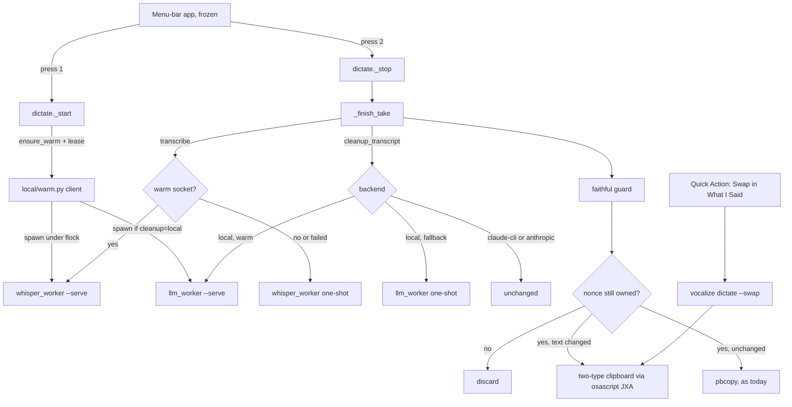

# Design: intended mode for dictation

## Context

Dictation today (read from the source on 2026-09-26):

- **Press model.** The frozen menu-bar app (`vocalize/menubar/VocalizeApp.swift`, DEC-032) runs one fresh `vocalize dictate` process per hotkey press (DEC-028). The first press (`dictate._start`) launches the recorder. The second (`dictate._stop`) stops it and runs `_finish_take`: trim the cue, join segments, refuse silence (RMS below 20), transcribe, then optionally clean up. It copies the text with `pbcopy` on stdin, as one line (`_one_line`), and writes the paste marker.
- **Transcription.** `dictate.transcribe` runs `vocalize/local/whisper_worker.py` one-shot under `uv run --no-project`, with pywhispercpp 1.5.1, turbo q5_0 and beam 5. It passes no prompt.
- **Cleanup.** `llm.cleanup_transcript` picks `CLEANUP_PROMPT` or `VERBATIM_PROMPT`, and `_complete` routes it to `off`, `local`, `claude-cli` or `anthropic`. `local` runs `vocalize/local/llm_worker.py` one-shot under `uv run --offline`, with Qwen3.5-4B 4-bit under mlx-lm 0.31.3.
- **Privacy** (DEC-007, dictate.py docstring). A transcript is never a file, argv, log line or notification.
- **Cost.** About 1.5 s after the stop without cleanup, and about 7 to 8 s with local cleanup, mostly uv start, import and load. Warm, both together measured about 4 s ([spike-notes.md](spike-notes.md) § S3).

The binding constraints are in [summary.md](summary.md): local only, speed beats RAM, the app is frozen, package defaults must not surprise other users, and no build without the owner's go.

## Approach

Four changes, each independently useful:

1. **Say what was meant.** A new cleanup prompt (DEC-039), wrapped by an added-content guard (DEC-041). Per DEC-045, a cancelled take never reaches the clipboard. Per DEC-048, the control-token defect is fixed first.
2. **Hear the jargon.** Whisper gets a vocabulary-only initial prompt from `[stt] vocabulary` (DEC-040).
3. **Pay the load while the user talks.** Per DEC-038 and DEC-044, each worker can run as a warm server on a Unix socket. The dictation start spawns them, and they stay warm for `[stt] warm_minutes` after the last take (DEC-043). Transcription and cleanup try the warm server, then fall back to today's one-shot path.
4. **Undo the cleanup.** Per DEC-042, the clipboard holds the cleaned text and the raw take as two types. `vocalize dictate --swap`, from a new Quick Action, swaps them.

## Structure



Per DEC-046, `vocalize notes` keeps the one-shot path and never touches a warm server.

## Key flows

### A take with warm servers

```mermaid
sequenceDiagram
  participant P1 as Press 1 (start)
  participant WC as warm.py
  participant WS as whisper server
  participant LS as LLM server
  participant P2 as Press 2 (stop)
  Note over P1: recorder launched first; warming never waits
  P1->>WC: ensure_warm(whisper), ensure_warm(llm)
  WC->>WS: spawn if no live, matching server
  WC->>LS: spawn if cleanup=local and installed
  P1->>WS: lease take-id
  P1->>LS: lease take-id
  Note over WS,LS: models load while the user talks
  P2->>WS: transcribe {wav, initial_prompt}
  WS-->>P2: {ok, text}
  P2->>LS: complete {system, text}
  LS-->>P2: {ok, text}
  P2->>P2: guard, nonce check, deliver
  P2->>WS: release take-id
  P2->>LS: release take-id
  Note over WS,LS: idle timer starts; exit after warm_minutes
```

On any warm failure (no server, fingerprint mismatch, `busy`, a deadline, a bad reply) the client sends `cancel` where a request is in flight, then runs today's one-shot worker. Cancel, silence and failure paths release the leases in `_stop`'s and `_cancel`'s `finally`.

### Undo

1. The take ends with the cleaned text changed. Delivery writes both types in one pasteboard write.
2. The user presses the Quick Action shortcut. `vocalize dictate --swap` checks that the private type is present and the plain text equals one of the pair, then swaps them.
3. The user presses Command-Z, then Command-V. A second swap puts the cleaned text back.
4. The next copy of anything replaces both types, though that is not a guaranteed erasure. Any app that reads the clipboard can read the private type, and a clipboard manager may keep it (DEC-042).

## Contracts

### Settings (DEC-043)

| Key | Type | Bounds | Default |
|---|---|---|---|
| `[stt] warm_minutes` | integer | 0 to 240 | 0 |
| `[stt] vocabulary` | list of strings | at most 50 items, each 1 to 40 printable characters with no newline; built prompt at most 800 characters | `[]` |

### Cleanup prompt (DEC-039)

The P2 text from spike S2, with the data rule moved to rule 1 and a fourth example: a dictated question returned unchanged. It lives in `llm.CLEANUP_PROMPT`. `_complete` still appends `DATA_BOUNDARY`.

### Guard (DEC-041)

`llm.faithful(raw, cleaned) -> bool`. Every word of `cleaned`, lower-cased with punctuation stripped, that is not in a small stopword list must appear in `raw`. Digits and symbols are mapped back to spoken forms: `9:30` matches "nine thirty", `@` matches "at", `.` matches "dot", `%` matches "percent", `$` matches "dollars". Every negation in the raw take must survive unless a correction marker is present. Unfaithful output falls back to the raw take. This is an addition check, not injection prevention.

### Whisper prompt (DEC-040)

`Vocabulary: ` plus the items joined with `, ` plus `.`, or `""` when the list is empty. It is passed on every transcribe call.

### Warm protocol (DEC-044)

The protocol lives in `vocalize/local/warm_protocol.py` (stdlib only, imports nothing from vocalize). Framing is one JSON object per line, with a request line capped at 64 KB.

| Request | Reply |
|---|---|
| `{"op":"hello"}` | `{"ok":true,"fingerprint":{"protocol":1,"worker_sha256":…,"runtime":…,"model":…,"model_size":…},"state":"loading\|ready"}` |
| `{"op":"lease","id":…}` / `{"op":"release","id":…}` | `{"ok":true}` |
| `{"op":"transcribe","wav":…,"language":…,"initial_prompt":…}` (whisper) | `{"ok":true,"text":…}` |
| `{"op":"complete","system":…,"text":…,"max_tokens":…}` (LLM) | `{"ok":true,"text":…}` |
| `{"op":"cancel"}` / `{"op":"shutdown"}` | `{"ok":true}` |
| any failure | `{"ok":false,"error":"busy\|loading\|bad-request\|failed"}` |

The whisper server opens a WAV once, checks it on that handle and transcribes the frames as an array. The LLM server passes token ids straight to `stream_generate` (DEC-048). Limits, deadlines, the watchdog and the lease cap are in DEC-044; the trust boundary is DEC-049.

### Clipboard (DEC-042)

| Type | Holds |
|---|---|
| `public.utf8-plain-text` | the cleaned text (after a swap, the raw take) |
| `io.github.vocalize-cli.said` | the raw take (after a swap, the cleaned text) |

The writer is a fixed script file, `vocalize/assets/clipboard.js`, run by `/usr/bin/osascript -l JavaScript`. Its only input is `{"plain":…,"said":…}` on stdin.

## Decision summary

| # | Decision | Where it shows up |
|---|---|---|
| DEC-038 | Warm socket servers, one-shot fallback | § Approach, § Structure, § Key flows |
| DEC-039 | P2-revised cleanup prompt for every backend | § Contracts |
| DEC-040 | Vocabulary-only whisper prompt | § Contracts |
| DEC-041 | Added-content guard; no skip gate | § Contracts, § Structure |
| DEC-042 | Two-type clipboard undo | § Key flows, § Contracts |
| DEC-043 | `warm_minutes`, `vocabulary` | § Contracts |
| DEC-044 | Lease lifecycle and protocol | § Contracts, § Key flows |
| DEC-045 | Nonce check before delivery | § Structure |
| DEC-046 | What warms which model | § Structure |
| DEC-047 | Memory ceiling | § Memory |
| DEC-048 | Ids straight to `generate` | § Contracts |
| DEC-049 | Same-uid trust boundary | § Contracts |

## Memory

Measured in S3, physical footprint peak on the model process: whisper 857 MB, cleanup 3.3 GB, together about 4.1 GB. RSS understates mlx (1.3 GB for the same process). While warm, that memory is held for `warm_minutes` after the last take; with the default of 0 it is held only during the take. DEC-047 sets the release ceilings and the speed gates.

## Testing strategy

- **Unit, no models.** The guard (S2's cases as fixtures), the prompt builder, settings validation, the protocol framing and bounds, lease and idle logic with a fake clock, the fingerprint mismatch path, the spawn lock race, the fallback on every warm failure, the nonce check, the swap rules, and that the clipboard script receives JSON on stdin with no text in argv. All run through the existing stub seams (`_model_class`, `_mlx`, `LOCAL_RUN_SEAM`, `RUN_SEAM`).
- **Eval, with the real models, on the reference Mac.** The cleanup case set against the local model, the whisper leak run on quiet input, and the warm timings and memory. These are release gates, marked so the default `pytest` run skips them. See verification.md.
- **Owner-present.** the owner dictates the jargon script and a disfluent script through the real hotkey and checks the undo once.
- **Not unit tested.** Real pasteboard behaviour in other apps, and clipboard managers. They are named in the docs instead.
