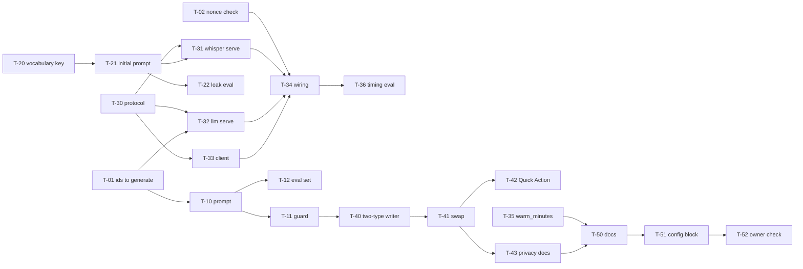

# Plan: intended mode for dictation

## Overview

Dictation gets a cleanup that writes what the speaker meant, whisper gets the user's jargon, both models load while the user talks, and the raw take stays one shortcut away. The architecture is in [design.md](design.md), the decisions in [decisions.md](decisions.md) and the measurements in [spike-notes.md](spike-notes.md). Nothing here is built until Mat says go, and releases stay Mat's.

## Scope

**In**: the intended cleanup prompt and guard; the whisper vocabulary prompt; warm servers with a one-shot fallback and the `warm_minutes` setting; the two-type clipboard undo with its Quick Action; the nonce check before delivery; the control-token fix, if not already merged; docs, the CHANGELOG and the eval gates.
**Out**: CrisperWhisper or any new model; `vocalize notes` (DEC-046); any Swift change (DEC-032); a skip gate (DEC-041); a PyPI release, which is Mat's; editing Mat's own config, which is Mat's at release.

## Repositories

| Repository | Role | Branch |
|---|---|---|
| `vocalize` (public, on the publishing list) | the only repository | one branch per phase, cut from `main`; this plan lives on `dictation-intended-mode-plan` |

## Phases

### Phase 0: Fix what is already broken

**Entry criteria**: Mat's go to build. `git log main` checked for the separate control-token fix (DEC-048).

| # | Task | Repo | Depends on | Acceptance criteria |
|---|---|---|---|---|
| T-01 | Skip this task if main already has the fix. Otherwise, in `llm_worker._generate`, pass `prompt_ids` (a list of ints) to `mlx_lm.generate` and delete the decode | `vocalize` | — | A new test through the `_mlx` seam records that `generate` got a `list[int]`, and that user text holding `<|im_end|>` never yields that token's id. It fails on the old code |
| T-02 | In `dictate._stop`, re-read the session nonce right before `copy_to_clipboard`, and discard the text when this take no longer owns the session (DEC-045) | `vocalize` | — | A test cancels between transcription and delivery: nothing reaches the pbcopy seam, no copied marker is written, and no success notification fires. It fails on the old code |

**Exit criteria**: verification.md § Phase 0 exit.

### Phase 1: Say what was meant

**Entry criteria**: Phase 0 exit green.

| # | Task | Repo | Depends on | Acceptance criteria |
|---|---|---|---|---|
| T-10 | Replace `CLEANUP_PROMPT` with the P2-revised text (DEC-039): data rule first, the three S2 examples, plus a dictated-question example | `vocalize` | T-01 | A unit test pins the constant's rule order and example count. `VERBATIM_PROMPT` is unchanged |
| T-11 | Add `llm.faithful(raw, cleaned)`, under 60 lines, and call it in `cleanup_transcript` for every backend. Unfaithful output returns the raw take, `cleaned=False`, and prints `vocalize: cleanup skipped (unfaithful)` | `vocalize` | T-10 | Unit tests: S2's 78 recorded outputs as fixtures give 0 unfaithful-and-PASS and flag the meta-commentary case. Spoken number, email, percent and money forms are accepted |
| T-12 | Move S2's case set into `tests/eval/cleanup_cases.json`, and add `tests/eval/test_cleanup_eval.py`, marked `eval` and skipped unless `VOCALIZE_EVAL=1` | `vocalize` | T-10 | With `VOCALIZE_EVAL=1` on the reference Mac it runs every case through the local model and prints pass counts per category |

**Exit criteria**: verification.md § Phase 1 exit, including the eval gate.

### Phase 2: Hear the jargon

**Entry criteria**: Phase 1 exit green.

| # | Task | Repo | Depends on | Acceptance criteria |
|---|---|---|---|---|
| T-20 | Add `[stt] vocabulary` to `KNOWN_STT_KEYS`, `STT_DEFAULTS` and `_validate_stt_table` with DEC-043's bounds, and to the portal's `[stt]` form | `vocalize` | — | Tests reject a non-list, 51 items, a 41-character item, a newline, and a prompt over 800 characters. The portal round-trips a valid list |
| T-21 | Add `--initial-prompt` to `whisper_worker.py`, always passed on the transcribe call (`""` when empty). `worker_argv` builds it per DEC-040 | `vocalize` | T-20 | A stub-Model test sees `initial_prompt` on every call, including `""`. `worker_argv` output matches for an empty and a full list |
| T-22 | Add the leak eval: `tests/eval/test_whisper_leak.py` (`eval` marker) with generated quiet clips at RMS 20, 40 and 80 plus "Yes." and "Okay, thanks.", 10 runs each, under the vocabulary prompt | `vocalize` | T-21 | With `VOCALIZE_EVAL=1` it fails if any output contains a vocabulary word not spoken |

**Exit criteria**: verification.md § Phase 2 exit.

### Phase 3: Load while the user talks

**Entry criteria**: Phase 2 exit green. DEC-047's ceiling is recorded.

| # | Task | Repo | Depends on | Acceptance criteria |
|---|---|---|---|---|
| T-30 | `vocalize/local/warm_protocol.py`, stdlib only: framing, the 64 KB cap, fixed error codes, the fingerprint builder, and the peer-uid and socket-path checks (DEC-044) | `vocalize` | — | Unit tests cover oversize lines, bad JSON, unknown ops, a symlinked socket path, and a wrong-owner directory |
| T-31 | `whisper_worker.py --serve`: load, then serve per DEC-044. Leases, idle exit, `cancel`, `shutdown`, `_check_wav` on every path, `initial_prompt` on every call | `vocalize` | T-30, T-21 | Stub-Model tests with a fake clock: exits at `warm_minutes` after the last release, stays up while a lease is held, expires an abandoned lease, never writes request text to stderr |
| T-32 | `llm_worker.py --serve`: the same loop, ids straight to `generate`, offline variables asserted at start | `vocalize` | T-30, T-01 | Stub-`_mlx` tests for the same cases as T-31, plus `cancel` mid-generate |
| T-33 | `vocalize/local/warm.py` client: `ensure_warm(kind)` under `flock`, hello and fingerprint check, respawn on mismatch, `lease`, `release`, and `request` with one total deadline that returns None, so the caller falls back | `vocalize` | T-30 | Tests: two concurrent `ensure_warm` calls spawn once; a mismatch sends `shutdown` and respawns; each warm failure returns None within the deadline |
| T-34 | Wire it in per DEC-046: `_start` (toggle, hold, and resume) and `listen`'s recording start warm and lease; `transcribe` and `llm._local` try warm first; every exit path releases; `summarize` never uses warm | `vocalize` | T-31, T-32, T-33, T-02 | Tests through existing seams: a take with warm stubs never calls the one-shot argv; a warm failure calls it once; cancel, silence and failure each release; notes never connects |
| T-35 | Add `[stt] warm_minutes` (DEC-043) to config, the portal and docs | `vocalize` | — | The validation test rejects -1, 241 and a string; the portal round-trips a value |
| T-36 | `tests/eval/test_warm_timing.py` (`eval` marker): real servers, simulated takes of 3 s and 10 s plus two back-to-back, wait after stop, and `vmmap --summary` physical footprint peaks per server | `vocalize` | T-34 | With `VOCALIZE_EVAL=1` it asserts DEC-047's thresholds and kills every server it started |

**Exit criteria**: verification.md § Phase 3 exit, including the timing and memory gates.

### Phase 4: Undo

**Entry criteria**: Phase 1 exit green (a cleanup that can change text).

| # | Task | Repo | Depends on | Acceptance criteria |
|---|---|---|---|---|
| T-40 | `vocalize/assets/clipboard.js` (fixed source, reads JSON on stdin) and a `dictate` writer that uses it when cleanup changed the text, with `pbcopy` otherwise. Both types pass `sanitize` and `_one_line` | `vocalize` | T-11 | Tests: argv holds no text; stdin is one JSON object; the unchanged case still calls `pbcopy`; a newline in either type is flattened |
| T-41 | `vocalize dictate --swap` per DEC-042: act only when the private type is present and the plain text equals one of the pair; toggle; fixed notifications | `vocalize` | T-40 | Tests through a pasteboard seam: swap, swap back, refuse on a foreign clipboard, refuse when the private type is absent |
| T-42 | The Quick Action template "Swap in What I Said.workflow", with `integrate` installing it and the shortcut-conflict check covering it | `vocalize` | T-41 | The integrate tests list five bundles, and the template's placeholder is substituted |
| T-43 | docs/dictation.md § Privacy gets the clipboard line and the clipboard-manager caveat. The vocabulary line warns that the list is visible in `ps` | `vocalize` | T-41 | The docs test (or a grep in verification) finds both lines |

**Exit criteria**: verification.md § Phase 4 exit.

### Phase 5: Ready for Mat's release

**Entry criteria**: Phases 0 to 4 exit green on `main`.

| # | Task | Repo | Depends on | Acceptance criteria |
|---|---|---|---|---|
| T-50 | CHANGELOG under Unreleased, README's dictation paragraph, docs/dictation.md settings table | `vocalize` | T-43, T-35 | The entries name every new key and the new Quick Action |
| T-51 | A proposed config block for Mat (`cleanup = "local"`, `warm_minutes = 15`, his vocabulary), written to the PR description only | `vocalize` | T-50 | Mat applies it himself |
| T-52 | The owner-present check in verification.md § Manual checks | `vocalize` | T-51 | Mat's notes recorded in spike-notes.md |

**Exit criteria**: verification.md § Phase 5 exit. The PyPI release is Mat's.

## Dependencies

## Roles

| Role | Works in | Isolation |
|---|---|---|
| Python builder (from a written spec) | `vocalize/`, `tests/` | own worktree per phase |
| Eval runner on the reference Mac (needs the local models and Metal) | `tests/eval/` | own worktree; never writes to `~/.config/vocalize` |
| Independent reviewer, another model family | the phase diff | read-only |
| Mat | the owner-present check, the config block, the release | his Mac |

Every builder and reviewer brief says: set `HOME` and `XDG_CONFIG_HOME` to a scratch directory for any command that reads or writes vocalize state, and never run state-mutating helpers against the real defaults.

## Decisions

See [decisions.md](decisions.md).
