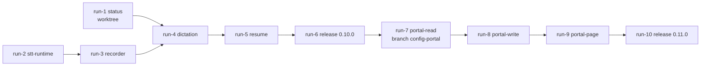

# Choreography: local dictation, readiness status, and the config portal

Ten runs, two releases. Each run is executed with `implement-spec`, one task at a time, and hands over through its `report.md` and a green `validate-exit.sh`. Sequencing is the harness's job (worktrees, agent teams, hooks as gates); this document is the contract and the audit trail, not a script to hand-walk.

## Order

| Run | Directory | Tasks | Branch / isolation | Tier | Owner needed |
|---|---|---|---|---|---|
| 1 | [run-1-status](./run-1-status/project-plan.md) | T-10…T-12 | worktree off `next-features`, parallel with run 2 | Sonnet | no |
| 2 | [run-2-stt-runtime](./run-2-stt-runtime/project-plan.md) | T-20…T-25 | `next-features`; T-21 first and alone | Sonnet (T-21 reviewed by Opus) | real install once, before run 6 |
| 3 | [run-3-recorder](./run-3-recorder/project-plan.md) | T-30…T-32 | `next-features`, after run 2 | Opus | first real build and grant, before run 6 |
| 4 | [run-4-dictation](./run-4-dictation/project-plan.md) | T-40…T-45 | `next-features`, after runs 1–3 (merge the worktree first) | Opus (T-44, T-45 Sonnet) | no |
| 5 | [run-5-resume](./run-5-resume/project-plan.md) | T-46, T-47 | `next-features`, after run 4; only run that edits `audio.py`/`chain.py`/`exceptions.py` | Opus + independent reviewer | no |
| 6 | [run-6-release-0-10-0](./run-6-release-0-10-0/project-plan.md) | T-50…T-53 | `next-features`; owner merges and publishes | Opus review, Sonnet docs | yes: manual checks 0–5, merge, publish |
| 7 | [run-7-portal-read](./run-7-portal-read/project-plan.md) | T-60, T-61 | `config-portal` off main after 0.10.0 | Opus | no |
| 8 | [run-8-portal-write](./run-8-portal-write/project-plan.md) | T-62…T-64 | `config-portal`, after run 7 | Opus + reviewer on the mutating routes | no |
| 9 | [run-9-portal-page](./run-9-portal-page/project-plan.md) | T-70, T-71 | `config-portal`, after run 8 | Sonnet | yes: T-71 UX pass |
| 10 | [run-10-release-0-11-0](./run-10-release-0-11-0/project-plan.md) | T-80…T-82 | `config-portal`; owner merges and publishes | Opus review | yes: manual 0 (second pass), 6, merge, publish |

## Artifact dependencies

| Produced by | Artifact | Consumed by |
|---|---|---|
| run 1 | `vocalize/readiness.py` (`readiness()`, `Row`, `_PROBES`) | run 4 (T-45 rows), run 7 (`/api/state`) |
| run 2 | `whisper_manifest.py`, `whisper_worker.py`, generalized `install.py` (`manifest=`, `files=`, `selftest_argv`), `local install --stt` | run 3 (build step in `install.py`), run 4 (worker), run 8 (install thread) |
| run 3 | `vocalize/recorder/` bundle build, `listen --check`, exit codes 0/2/3/4/5 | run 4 (state machine), run 6 (manual 1) |
| run 4 | `dictate.py`, `[stt]` config, Quick Action, STT rows | run 5 (dialog), run 6 |
| run 5 | interrupt record in `audio.py`/`chain.py`/`cli.py`, `vocalize resume` | run 6 (manual 4) |
| run 6 | 0.10.0 on PyPI, `review-0.10.0.md` | run 7 entry (version on main ≥ 0.10) |
| run 7 | `portal.py` auth bootstrap, `/api/state`, headers | run 8 |
| run 8 | writes with `write_config_if_unchanged`, preview, install thread, `vocalize portal` | run 9 (route contract) |
| run 9 | `vocalize/assets/portal.html` + `portal.js` | run 10 |
| run 10 | 0.11.0 on PyPI, `review-0.11.0.md` | — |

## Handoff protocol

1. **Exit.** The executor runs `validate-exit.sh` from anywhere (it changes to the repository root), reads the exit status directly — never through a pipe — and writes `report.md` in the run directory: one line per task (`T-nn: done | partial | skipped — reason`), the security-gate result (negative tests by id), deferred items, and the final line `validate-exit: PASS` copied from the real run. A partial run is reported as partial; it is not the executor's call to narrow scope.
2. **Commit.** Every working state is committed on the run's branch (`wip:` is fine); feature branches may be pushed; `main` is never pushed by an agent. The diff is scanned for secrets before staging.
3. **Entry.** The next run's script checks the previous `report.md` for `validate-exit: PASS`, the previous run's key artifact, a clean tree and a green suite before any edit. A red entry stops the run; it does not "fix forward".
4. **Concurrent sessions.** Other sessions may be in this repository. Fetch before trusting `main`; use the worktree for run 1; re-read a file before editing it. Reviewer and fixer probes never touch the real config or ledger (`XDG_CONFIG_HOME`/`HOME` isolated).
5. **Owner gates.** Runs 6 and 10 end with the owner's merge (squash) and publish. Agents prepare the release, verify the PyPI digests after the owner publishes (the last exit check), and never run the publish themselves.
6. **Security gate.** Every run's exit criteria include the negative tests from its acceptance criteria; runs 6 and 10 add the adversarial review whose findings table (Severity, Status columns) is what the exit check greps.

## Pre-build validation

Every `validate-exit.sh` was executed on 2026-09-02 before any run started. Expected and observed: artifact checks fail (the module, test file, command or document does not exist yet), regression checks pass (current suite and ruff), and no script reports zero checks. The log summary is recorded below by the session that generated the scripts.

| Run | Checks | Passed (entry preconditions + regressions) | Failed (artifacts not built yet) | Script exit |
|---|---|---|---|---|
| 1 status | 11 | 6 | 5 | 1 |
| 2 stt-runtime | 15 | 8 | 7 | 1 |
| 3 recorder | 14 | 5 | 9 | 1 |
| 4 dictation | 17 | 6 | 11 | 1 |
| 5 resume | 13 | 6 | 7 | 1 |
| 6 release 0.10.0 | 15 | 6 | 9 | 1 |
| 7 portal-read | 12 | 5 | 7 | 1 |
| 8 portal-write | 13 | 5 | 8 | 1 |
| 9 portal-page | 12 | 4 | 8 | 1 |
| 10 release 0.11.0 | 13 | 4 | 9 | 1 |

No check timed out. Passing checks are the intended-to-pass kind only: branch/tree state, "artifact does not exist yet" entry guards, the current suite and ruff, and the wheel's dependency audit. The audit caught three vacuous passes on the first run and they were pinned before commit: run 3's `listen --check` accepted click's "no such command" exit 2 (now requires a status word); run 4's Quick Action test passed on the three existing bundles (now `-k dictate`); run 2's installer check passed on the Kokoro tests alone (now a separate `-k whisper` check that fails until the tests exist, with the Kokoro run labelled as the regression it is).
