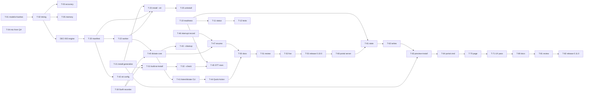

# Plan: local dictation, readiness status, and the config portal

## Overview

Two releases of vocalize. 0.10.0 adds hotkey-triggered local dictation and a one-screen `vocalize status`; 0.11.0 adds the config portal on top of the same readiness aggregation. Architecture and contracts are in [design.md](./design.md); every phase exit maps to a command in [verification.md](./verification.md); one-way doors are in [decisions.md](./decisions.md).

## Scope

**In:** `vocalize listen` / `vocalize dictate`, the "Dictate with Vocalize" Quick Action (⌃⌥⌘D), a Swift recorder bundle built at install, `vocalize local install --stt` with a pinned Whisper manifest, `[stt]` config, opt-in `--cleanup`, `vocalize status`, and the `vocalize portal` local web page with its hardened auth flow.

**Out:** hold-to-talk (event tap + Input Monitoring), auto-paste (Accessibility), a menu-bar agent, local-LLM cleanup, a resident/pre-warmed STT worker (only if the spike demands it), a wizard chain editor, streaming for cloud TTS providers.

## Repositories

| Repository | Role | Branch |
|---|---|---|
| `vocalize` (this repo) | the only one | `next-features` (0.10.0), then `config-portal` (0.11.0) off main |

## Phases

### Phase 0: Spike (de-risk)

**Entry criteria**: research docs read; scratch directory outside the repo; throwaway code.

| # | Task | Repo | Depends on | Acceptance criteria |
|---|---|---|---|---|
| T-01 | Download base.en, small.en, large-v3-turbo-q5_0; record final URL, bytes, sha256 from the completed files | scratch | — | three sha256s recorded from local files, not HTTP headers |
| T-02 | Time each model on a ~30 s 16 kHz synthetic clip under `uv run --no-project --with pywhispercpp==1.5.1`; record load s, transcribe s, max RSS; cold vs warm uv start | scratch | T-01 | a table with numbers for all three models |
| T-03 | Jargon accuracy proxy on synthetic speech (say + Kokoro clips) per model, and Apple on-device `SFSpeechRecognizer` on the same clip | scratch | T-02 | hits/misses listed per engine; Apple on-device support and permission state recorded |
| T-04 | Microphone from a Quick Action: bare CLI vs signed bundle via `open -a`, from the shell and from an `automator`-invoked temporary Service; RMS of captured audio; temporary Service removed | scratch | — | which context recorded non-silent audio is stated with evidence; note that `automator` ≠ the real Services runner |
| T-05 | Memory pressure and swap during small.en with the usual apps open | scratch | T-02 | `vm_stat`/`memory_pressure` before/during recorded |

**Exit criteria**: DEC-002 has evidence and is decided; the mic-from-Quick-Action question has a stated answer (or a stated gap to close with the owner in Phase 5).

**Status: done 2026-09-01** — see [spike-2026-09-01.md](./spike-2026-09-01.md). All bars passed; DEC-002 decided; the first-run grant from a real Service remains a manual check (T-52).

### Phase 1: `vocalize status` (readiness aggregation)

**Entry criteria**: branch `next-features` off main at the 0.9.1 tip; suite green.

| # | Task | Repo | Depends on | Acceptance criteria |
|---|---|---|---|---|
| T-10 | `vocalize/readiness.py`: `readiness(file_config, *, timeout=2.0) -> list[Row]` — one row per chain link (credential source via `key_source`/`polly_credential_status`, budget vs ledger, Kokoro `installed()`), each probe on a daemon thread joined with the timeout, one in-flight probe per name (module registry), never raising | vocalize | — | a probe that raises yields a `warn` row; a probe blocked on a `threading.Event` that is never set yields a `warn` row within `timeout + 0.5 s`, and a second `readiness()` call returns at once without starting another thread (`threading.active_count()` unchanged) |
| T-11 | `vocalize status` command: colored one-screen output, exit 0 when every row is `ok`, 1 otherwise; `--json` prints the rows | vocalize | T-10 | `vocalize status --json` is valid JSON with `name/state/detail/action` per row; exit code matches the worst state |
| T-12 | Tests: rows for each provider state; timeout enforcement with an uninterruptible fake (Event never set); one thread per name across repeated calls; exit codes; `--json` shape; no keychain touched when `ELEVENLABS_API_KEY` etc. are set; the process exits promptly with a probe still blocked | vocalize | T-10, T-11 | ≥ 14 new tests green |

**Exit criteria**: verification.md § Phase 1.

### Phase 2: STT runtime (manifest, installer, worker)

**Entry criteria**: DEC-002 decided.

| # | Task | Repo | Depends on | Acceptance criteria |
|---|---|---|---|---|
| T-20 | `vocalize/local/whisper_manifest.py`: base.en, small.en, large-v3-turbo-q5_0 with the sha256s from T-01; `RUNTIME_PACKAGE = "pywhispercpp==1.5.1"`; `MODEL_DIR`; `worker_path()`; `LANGUAGES` allowlist; `is_english_only(model)` | vocalize | T-01 | manifest test: three entries, https URLs pinned to one HF revision, 64-hex sha256, sizes > 0 |
| T-21 | Generalize `vocalize/local/install.py` per design § Installer generalization: `manifest=` on `_model_dir`, `file_is_verified`, `stamp_path`, `write_stamp`, `read_stamp`, `installed`; a `files=` subset for the stamp and `installed()`; `selftest(uv, manifest, ...)` runs `manifest.selftest_argv(model_dir)`; `kokoro_manifest.selftest_argv` reproduces today's argv exactly; Kokoro stamp byte-identical | vocalize | — | existing `test_local_install.py` green unchanged; a stamp written for one whisper model lists only that model; new tests drive the whisper manifest through `opener_for()` with nothing written outside tmp |
| T-22 | `vocalize/local/whisper_worker.py`: `--transcribe`, `--selftest`; `_model_class()` seam; runtime imports inside functions | vocalize | T-20 | AST test: no `pywhispercpp`/`numpy` import at module level; protocol test against a stub model class |
| T-23 | `vocalize local install --stt [--model]`: plan printout, confirmation, download of the selected model only, verify, stamp, `uv run --no-project` selftest with `cwd=tempfile.gettempdir()` (this selftest also pays the one-time ~8 s Metal shader compile so no dictation ever does); `local status` STT block | vocalize | T-20, T-21, T-22 | CLI test with fakes: prints plan, honors decline/`--yes`, skips a verified file, refuses a hash mismatch, idempotent second run |
| T-24 | Move `uv_path()` from `providers/kokoro.py` to `vocalize/local/__init__.py`; re-export; update the Kokoro tests that patch it | vocalize | — | all Kokoro tests green patching the new home |
| T-25 | `vocalize local uninstall --stt` removes the STT model directory and the recorder bundle after a confirmation (or `--yes`); `local status` lists every model file on disk with its size | vocalize | T-23 | test with a populated fake model dir: declined leaves everything, `--yes` removes both, second run says nothing to remove; status output names sizes |

**Exit criteria**: verification.md § Phase 2.

### Phase 3: Recorder bundle

**Entry criteria**: DEC-001 decided (yes); T-04 evidence available.

| # | Task | Repo | Depends on | Acceptance criteria |
|---|---|---|---|---|
| T-30 | `vocalize/recorder/VocalizeRecorder.swift` (~100 lines): `AVAudioRecorder` 16 kHz mono 16-bit with a written-format assertion (`afconvert` fallback), `--device NAME` and `--list-devices`, stop-file polling, `rec.pid`, max-seconds, exit codes 0/2/3/4, `--check` (authorization + device); `Info.plist.in` with `NSMicrophoneUsageDescription`, `LSUIElement`, `LSBackgroundOnly`, `CFBundleIdentifier cards.arda.vocalize.recorder`; the recorder writes its own PID to `rec.pid`; `--check` exits 0/2/3/5 per the contract | vocalize | — | `xcrun swiftc -parse` passes in the suite (skipped without swiftc); the plist template lints; a recorded file opens with stdlib `wave` at 16000 Hz mono 16-bit |
| T-31 | Build-at-install in `install.py`: compile with `xcrun swiftc -O -framework AVFoundation`, assemble the bundle under `~/.cache/vocalize/bin/`, `codesign -s - --force`; rebuild only when the source hash changes (stored in the stamp); print a "re-grant the microphone" warning when a rebuild happens; a missing `swiftc` and an unaccepted Command Line Tools license are detected separately and each prints its fix (`xcode-select --install` / the license command) instead of a raw compiler error | vocalize | T-30, T-21 | tests with a fake compiler: bundle layout, stamp carries the source hash, unchanged source → no rebuild, changed source → rebuild + warning; fake compiler absent → the install message names `xcode-select --install`; fake compiler emitting the license text → the message names the license step |
| T-32 | `vocalize listen --check`: recorder `--check` exit code → authorized (0) / denied (2) / device missing (3) / not determined (5), install state, input device; the message names the next step | vocalize | T-31 | test maps each of the four exit codes to its message; an unknown code prints a generic message and never a traceback |

**Exit criteria**: verification.md § Phase 3.

### Phase 4: Dictation core, CLI, Quick Action

**Entry criteria**: Phases 2 and 3 green; DEC-003, DEC-006, DEC-007 decided.

| # | Task | Repo | Depends on | Acceptance criteria |
|---|---|---|---|---|
| T-40 | `vocalize/dictate.py` state machine: start (claim `~/.cache/vocalize/dictate.session` with `O_CREAT\|O_EXCL`, `stop_playback(remember=True)`, `mkdtemp` 0700, launch recorder via `open -a`, Tink through `audio.play`), stop (recorder alive = `rec.pid` PID exists and its process name is the recorder; touch stop file, wait, silence guard, transcribe, clipboard via `pbcopy` on stdin, Glass, fixed-text notification), cancel (second press within 2 s, or `--cancel`), refuse while transcribing (Pop), dead recorder (no `rec.pid`, dead PID, or another process name) → clear the session, Pop, fixed-text failure notification naming `vocalize listen --check`, exit 1, never a relaunch; max-seconds backstop kill only after the name check, `finally` cleanup incl. the session file, stale `vocalize-dictate-*` sweep (> 24 h) | vocalize | T-22, T-30 | tests with a fake recorder script and fake worker: each transition; transcript never in argv, notification text or a file; tmpdir and session file gone on every exit path including worker crash; a `rec.pid` naming a dead PID or a PID with another process name is never signalled; a recorder that exits 2 before writing `rec.pid` leaves no session and produces the failure notification, and the next press starts again only because the user pressed; two concurrent starts → exactly one recorder |
| T-41 | `vocalize listen` (stdout primitive; Enter/Ctrl-C/max-seconds), `--wav FILE` (trusted input, documented; malformed-WAV negative test), `--toggle`, `vocalize dictate` alias | vocalize | T-40 | CLI tests via `CliRunner` with the fakes |
| T-42 | `[stt]` config: `KNOWN_CONFIG_KEYS`, `_validate_stt_table` (model allowlist, language allowlist, `.en` model + non-`en` language → `ConfigError`, `max_seconds` integer 1–600 else `ConfigError`, `input_device` shape check: ≤ 128 chars, no control characters, no leading `-`, else `ConfigError`), `vocalize settings` lines | vocalize | T-20 | config tests per rule incl. `max_seconds = 0`, `"abc"`, `601` and `input_device = "--foo"`, `"a\nb"` refused; `hooks/speak_options.py` parser test still green |
| T-43 | `--cleanup`: `claude -p` with the fixed prompt from design § Cleanup pass, transcript on stdin, `--disallowedTools '*'`, `timeout=120`, PATH from baked `CLAUDE_BIN`/`CLAUDE_EXTRA_PATH`; timeout, non-zero exit or empty output → raw transcript + "cleanup skipped" notification | vocalize | T-40 | test: argv has the wildcard deny, transcript only on stdin, fallback on non-zero exit, on `TimeoutExpired` and on empty output; an injection-shaped transcript reaches the fake unchanged on stdin and the prompt text contains the data-not-instructions sentence |
| T-44 | `hooks/quick_actions/Dictate with Vocalize.workflow` (copy of Stop Vocalize's no-input shape, id `cards.arda.vocalize.dictate`; script exports `CLAUDE_BIN`/`CLAUDE_EXTRA_PATH` then `exec "$BIN" dictate`); installer `BUNDLE_NAMES` +1 | vocalize | T-41 | bundle tests: no `NSSendTypes`, `serviceProcessesInput = 0`, `inputMethod = 1`, placeholders substituted, `plutil -lint` clean |
| T-45 | Readiness rows for STT: model installed, recorder built, microphone authorization, input device present | vocalize | T-10, T-32 | `vocalize status` shows the four rows with correct states under fakes |
| T-46 | Player-side interrupt record (DEC-003, design § Interrupted-read resume) in the core modules: `audio.stop_playback(remember=False)` writes `interrupt.request` (0600) before the SIGTERM; `audio._run_tracked` consumes the marker via `audio.take_interrupt_request(proc.pid)` at the moment the player exits by SIGTERM (on the playing thread) and keeps `last_stop()` → (path, elapsed, remembered); `exceptions.PlaybackStopped` gains `remaining_text`, filled by `chain._speak` from `chunks[index:]`; `cli._run_tts` captures `play_audio(dest)`'s return value and writes `interrupted.<ext>` (a copy of `last_stop().path`, i.e. the current piece or the whole file) / `interrupted.txt` / `interrupted.json` (0600) at both stop sites | vocalize | — | tests with a fake player exiting `-SIGTERM`: streamed stop mid-piece 3 of 5 → record holds piece 3's bytes (not the joined audio), piece 3's elapsed offset and the text of pieces 4–5; a stop that lands while a slow chunk is still synthesizing (fake provider sleeping 15 s) still produces a record; non-streamed stop → record with the whole file and empty remaining text; no marker (plain `vocalize stop`) → no record; marker naming another PID or older than 10 s → no record and marker removed; files are 0600; existing playback tests unchanged |
| T-47 | `vocalize resume [--forget]` and the dictation dialog: read the record (ignore and delete when older than 1 h), `afconvert` to WAV when needed, `wave` slice from the offset, `audio.play`, then `chain.run` on the remaining text with the recorded provider forced; `dictate` shows the osascript dialog (default Continue, 15 s give-up = no) only for a record newer than its own stop; record deleted on resume, decline and `--forget` | vocalize | T-40, T-46 | tests with a fake `afconvert` and fake chain: slice length = duration − offset; continuation called with the remaining text and forced provider; declined dialog and `--forget` delete the record; stale record ignored and deleted; `resume` with no record prints "Nothing to resume" and exits 0 |

**Exit criteria**: verification.md § Phase 4.

### Phase 5: Release 0.10.0

**Entry criteria**: Phases 1–4 green; adversarial review run on the branch and confirmed findings fixed.

| # | Task | Repo | Depends on | Acceptance criteria |
|---|---|---|---|---|
| T-50 | Docs: README (Dictation section, `status`), `docs/dictation.md`, `docs/installation.md` gains a dictation layer, CHANGELOG 0.10.0, version bump | vocalize | Phase 4 | every command in the docs exists in `--help` |
| T-51 | Adversarial review workflow (security, correctness, integration lenses; two refuters per finding with evidence) and fixes | vocalize | Phase 4 | zero confirmed critical/high findings open |
| T-52 | Live verification with the owner present: microphone permission granted to "Vocalize Recorder", a real-voice dictation from TextEdit via ⌃⌥⌘D, `vocalize stop` mid-read unaffected, `status` on the real machine | vocalize | T-50 | verification.md § Manual checks ticked |
| T-53 | Merge and publish on the owner's word; main pushed by the owner | vocalize | T-52 | PyPI 0.10.0 hashes match; clean-venv install pulls no pywhispercpp/numpy |

### Phase 6: Portal server (0.11.0)

**Entry criteria**: 0.10.0 merged; branch `config-portal`; DEC-004 and DEC-005 decided.

| # | Task | Repo | Depends on | Acceptance criteria |
|---|---|---|---|---|
| T-60 | `vocalize/portal.py`: `route(method, path, headers, body)`; `ThreadingHTTPServer` on `127.0.0.1:0`; one-time code (`secrets.token_urlsafe(32)`) + session token; `Host` check on every request; five wrong codes → shutdown with a message; security headers incl. `media-src 'self' blob:`; token header-only; idle watchdog suspended during installs | vocalize | — | route tests: every mutating route refuses token-in-query; wrong `Host` refused on `/`, `/portal.js`, `/api/session` and every API route; `/` serves no secret; code single-use and expiring; the sixth wrong code finds the server gone |
| T-61 | `GET /api/state` from `readiness()` + chain + settings + budgets + masked keys + the `[stt]` table, with per-provider timeouts | vocalize | T-10, T-60 | a hanging provider yields a `warn` row and the response returns; ten polls against a blocked probe start one thread |
| T-62 | Writes: chain, provider table, `[stt]` table, key login — through `config._validate_*` and `wizard.write_config_if_unchanged` with compare-and-swap on mtime+sha256 of the file read at page load, sentinel `"absent"` for a missing file and an `O_EXCL` first write | vocalize | T-60 | a file changed on disk between read and write is refused with a reload message; a file created underneath an `"absent"` fingerprint is refused; validators' errors surface as 400 with the CLI's wording; the login response body never contains the submitted key |
| T-63 | Preview endpoint through `chain.run(text, chain=[name], file_config=file_config, forced=True)` (returns `(audio, name, ext)`; never plays) under one module lock (bytes for `fetch → Blob`, `Accept-Ranges: none`) and Kokoro/STT install thread + progress endpoint | vocalize | T-60, T-21 | preview with a monkeypatched provider module: a budget-capped provider returns the CLI's refusal, a repeat request is a cache hit, two concurrent requests run one at a time; install progress dict advances under a fake opener |
| T-64 | `vocalize portal` command: mint, serve, `webbrowser.open("…/#code=…")`, print the URL, loud note that the portal assumes a single-user machine | vocalize | T-60 | CLI test with a fake browser opener |

### Phase 7: Portal page

| # | Task | Repo | Depends on | Acceptance criteria |
|---|---|---|---|---|
| T-70 | `vocalize/assets/portal.html` + `portal.js` (no inline script, no external resources, system fonts, inline SVG): tabs Chain (up/down), Providers (voice dropdown + preview + speed + budget), Keys (masked; `autocomplete="off"`), Usage, Local (install with progress; `[stt]` model, language and input device from `--list-devices`); persistent readiness sidebar from `/api/state` | vocalize | Phase 6 | served HTML contains no `<script>` body and no external URL; every tab's requests carry the header |
| T-71 | UX pass with the owner (one iteration budgeted) | vocalize | T-70 | owner's changes applied |

### Phase 8: Release 0.11.0

| # | Task | Repo | Depends on | Acceptance criteria |
|---|---|---|---|---|
| T-80 | Docs (README Portal section, `docs/installation.md`), CHANGELOG 0.11.0, version bump | vocalize | Phase 7 | commands in docs exist |
| T-81 | Adversarial review (security lens mandatory: token bootstrap, rebinding, CSRF, clickjacking, key handling) and fixes | vocalize | Phase 7 | zero confirmed critical/high open |
| T-82 | Live check in a browser with the owner; merge and publish on the owner's word | vocalize | T-81 | PyPI 0.11.0 hashes match |

## Dependencies

## Roles

| Role | Works in | Isolation |
|---|---|---|
| Spike runner (judgement: permissions, Swift, measurements) | scratch directory | own, outside the repo |
| Runtime plumbing (manifest, installer generalization, worker, tests) — mechanical from the Kokoro precedent | `vocalize/local/`, `tests/` | shared checkout, sequential with recorder work |
| Recorder engineer (Swift, bundle, codesign) — judgement | `vocalize/recorder/`, `vocalize/local/install.py` | shared checkout |
| Dictation core + CLI (state machine, security-sensitive) — judgement | `vocalize/dictate.py`, `vocalize/cli.py`, `hooks/` | shared checkout, after runtime + recorder |
| Readiness/status — mechanical once the row contract is fixed | `vocalize/readiness.py`, `vocalize/cli.py` | can run in parallel with Phase 2 in its own worktree |
| Portal server (auth flow, security) — judgement | `vocalize/portal.py`, `tests/test_portal.py` | branch `config-portal` |
| Portal page — mechanical from the route contract | `vocalize/assets/` | same branch, after the server |
| Reviewers — independent agents per lens | read-only | — |

## Decisions

Two-way doors, decided here in one line each:

- Chord ⌃⌥⌘D (owner's choice); cancel = second press within 2 s or `vocalize listen --cancel`.
- Feedback sounds: `/System/Library/Sounds/Tink.aiff` (start), `Pop.aiff` (stop / refused), `Glass.aiff` (text landed), all through `audio.play` so they queue and are stoppable.
- `max_seconds` default 120, hard ceiling 600, enforced in the recorder and by a backstop kill.
- Manifest ships base.en, small.en, large-v3-turbo-q5_0 only (tiny.en dropped until hashed from a real download).
- Stale `vocalize-dictate-*` directories older than 24 h are swept on the next `listen`/`dictate`.
- Recorder rebuilt only when its source hash changes; the stamp records the hash.
- `--wav FILE` is trusted input, said so in `--help`, with a malformed-WAV negative test.
- Phase 3 is budgeted at 6–8 h, not 4.
- Portal: `ThreadingHTTPServer`, external `portal.js`, no external resources, `Accept-Ranges: none`, `autocomplete="off"`, idle watchdog paused during installs.
- Spike outcomes folded in: `small.en` default, turbo and base kept as real options, no resident worker, Metal warm-up in the selftest, input-device selection (`--device`, `--list-devices`, `[stt] input_device`), WAV format assertion, resume dialog gives up after 15 s.
- Review fold (2026-09-02, see decisions.md § Review round): the interrupt record is written by the playing process, not the stopper (T-46/T-47); the record may hold the read's remaining text for up to an hour, 0600; readiness probes are daemon threads with one in-flight probe per name; the recorder writes its own PID and `dictate` never signals a PID without a process-name check; the toggle claims a session file with `O_EXCL`; the portal's in-browser preview plays outside the machine-wide playback lock — accepted, because the browser cannot take a file lock and previews are a few seconds long; `[stt]` is editable in the portal's Local tab; `local uninstall --stt` exists; `--check` uses exit 5 for not-determined.
- Effort: 0.10.0 ≈ 42 h agent time (spike done, status 7, runtime 8 incl. uninstall, recorder 8, core 16 incl. the player-side record and resume, release 3); 0.11.0 ≈ 62 h (server 22, page 24, review + docs + UX pass 16).

## Suggested run boundaries

For split-plan, not pre-split here: the plan is too large for one execution run (≈ 45 tasks, three languages). Natural cuts follow the phase boundaries, with two phases worth halving: Phase 4 into 4a (T-40…T-45, the state machine and CLI) and 4b (T-46, T-47, the core-module interrupt record and resume — the security-relevant edit to `audio.py`/`chain.py`/`cli.py` deserves its own review); Phase 6 into 6a (T-60, T-61, auth + state, read-only) and 6b (T-62…T-64, writes, preview, install — the mutating surface). Phase 1 can run in parallel with Phase 2 in its own worktree.

One-way doors: see [decisions.md](./decisions.md).
